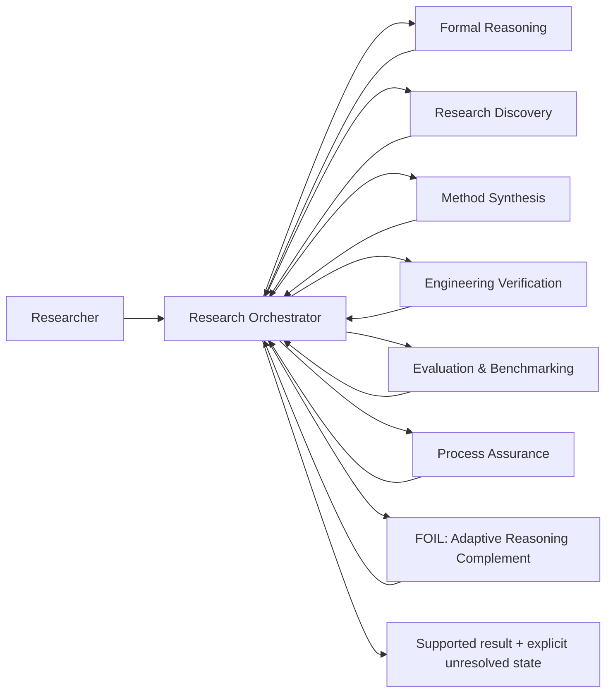

# Evidence-Governed Research Toolkit

**Modular research software for evidence-governed AI-assisted reasoning, verification, evaluation, and reproducibility.**

[](https://github.com/Kitahl/The-Gauntlet/actions/workflows/validate.yml)
[](https://github.com/Kitahl/The-Gauntlet/actions/workflows/codeql.yml)
[](LICENSE)
[](CHANGELOG.md)

> **Research status:** public research-software specification and validation package. The repository contains evidence-bearing structural/source checks, but does **not** yet claim that the complete system improves human reasoning, scientific discovery, or general AI capability in prospective deployment.

**Demo:** https://kitahl.github.io/The-Gauntlet/  
**5-minute evaluator path:** [`docs/EVALUATOR_QUICKSTART.md`](docs/EVALUATOR_QUICKSTART.md)  
**Research statement:** [`RESEARCH.md`](RESEARCH.md) · **Reproducibility:** [`REPRODUCIBILITY.md`](REPRODUCIBILITY.md) · **Roadmap:** [`ROADMAP.md`](ROADMAP.md)

---

## Why this project exists

AI-assisted research can fail even when the prose is persuasive, multiple agents agree, software tests are green, or a benchmark score is high. This project treats those signals as **evidence with scope**, not as automatic proof.

The core research question is:

> **Can a modular, evidence-governed reasoning workflow improve traceability, verification discipline, and independent usefulness in AI-assisted research without confusing confidence, consensus, or passing software checks with scientific validity?**

The toolkit routes work according to the **epistemic obligation**: what must be proved, searched, executed, measured, independently checked, or left unresolved.

## Architecture



Full architecture and evidence flow: [`docs/ARCHITECTURE.md`](docs/ARCHITECTURE.md).

## Research modules

Professional display names are used for the research portfolio. Existing technical IDs and slash-command aliases are retained for backwards compatibility.

| Research module | Technical ID / alias | Responsibility |
|---|---|---|
| **Research Orchestrator** | `soul`, `/soul` | Frame, decompose, route, integrate, audit, release |
| **Formal Reasoning** | `mathbot`, `/mind` | Proof, logic, probability/statistics, counterexamples, formalization |
| **Research Discovery** | `scoutbot`, `/space` | Literature, prior art, existing software, cross-domain terminology |
| **Method Synthesis** | `novelbot`, `/reality` | New mechanisms only after known methods fail a named constraint |
| **Engineering Verification** | `codebot`, `/power` | Architecture, implementation, integration, execution, software verification |
| **Evaluation & Benchmarking** | `benchbot`, `/time` | Baselines, capability measurement, ceilings, cost, stop/go |
| **Process Assurance Framework** | `infinity-gauntlet`, `/gauntlet` | Frame/process audit, inherited-number checks, stale-state and false-green defense |
| **Decision Preflight Protocol** | `meditate` | Grounding before consequential decisions and after failures |
| **Evidence Review Panel** | `council-of-elders`, `/council` | Selective independent evidence/perspective review with control comparison |
| **FOIL — Adaptive Reasoning Complement** | `foil`, `/foil` | Task/user-specific missing-method support and independent-transfer tracking |

## What is currently supported by evidence

| Claim | Evidence status | Where to inspect |
|---|---|---|
| Public Research Orchestrator and Process Assurance specifications do not require the previous private runtime paths | source/package audit | `validation/SOUL_GAUNTLET_PUBLIC_AUDIT.md` |
| FOIL research-integration structure/source/regression checks passed the recorded validator | **94/94 PASS** | `validation/FOIL_RESEARCH_INTEGRATION_VALIDATION.json` |
| FOIL frozen behavioral-contract cases are represented in the specification | **18/18 PASS-SPEC** | `validation/FOIL_RESEARCH_INTEGRATION_BEHAVIORAL_CONTRACT_VALIDATION.json` |
| Public claims have a machine-readable provenance map | implemented | `docs/content-provenance.json` |
| FOIL improves independent human reasoning in deployment | **not established** | planned in `ROADMAP.md` |

`PASS-SPEC` means the specification contains the required decision behavior; it is not a behavioral execution result.

## Quick evaluation

### 1. Clone and create an isolated environment

```bash
git clone https://github.com/Kitahl/The-Gauntlet.git
cd The-Gauntlet
python -m venv .venv
```

Activate the environment for your shell, then install the pinned validation dependency:

```bash
python -m pip install --upgrade pip
python -m pip install -r requirements-dev.txt
python -m playwright install chromium
```

### 2. Run the reproducible public checks

```bash
python validation/validate_soul_gauntlet_public.py
python validation/validate_showcase.py
python -m compileall -q validation
```

For interpretation and evidence boundaries, read [`REPRODUCIBILITY.md`](REPRODUCIBILITY.md).

## Research methodology

The repository separates:

1. **Generation** — candidate reasoning, methods, code, hypotheses.
2. **Evidence acquisition** — primary sources, formal derivations, executable observations, benchmarks.
3. **Verification** — a verifier matched to the exact claim and failure mode.
4. **Assurance** — process/frame audits that attack what ordinary candidate review can miss.
5. **Evaluation** — strong baselines, matched budgets, ablations, uncertainty, and negative results.
6. **Human learning** — assisted performance kept distinct from later independent ownership and transfer.

Planned behavioral comparisons include strong direct AI, static rules, adaptive FOIL, module ablations, native verification vs same-model critique, and Evidence Review Panel vs matched-evidence direct control. See [`RESEARCH.md`](RESEARCH.md).

## Repository structure

```text
.
├── skills/                  # research-method specifications
├── research/                # research basis and source records
├── validation/              # deterministic/specification evidence
├── docs/                    # architecture, evaluator path, public showcase
├── .github/                 # CI, CodeQL, dependency review, issue/PR forms
├── RESEARCH.md              # question, method, baselines, ablations
├── REPRODUCIBILITY.md       # exact reproduction/evidence protocol
├── ROADMAP.md               # evidence-first research roadmap
├── CITATION.cff             # GitHub/software citation metadata
├── CHANGELOG.md             # release history
├── CONTRIBUTING.md          # contribution/research mechanism standards
├── SECURITY.md              # vulnerability reporting
└── LICENSE                  # MIT license
```

## Research integrity principles

- User authority governs voluntary goals and actions; evidence governs factual warrant.
- A citation must support the exact claim and scope being relied on.
- A green test suite certifies only the properties it actually observes.
- Multi-agent agreement is not independent verification by itself.
- Novelty and absence claims are scoped to searched evidence.
- Negative results and failed mechanisms are retained when they change the credible search space.
- Behavioral efficacy is not inferred from specification correctness.

## Citation

GitHub will expose citation information from [`CITATION.cff`](CITATION.cff). Cite the exact release or commit used. A DOI will be added after the first evidence-bearing stable release is archived.

## Contributing and governance

See [`CONTRIBUTING.md`](CONTRIBUTING.md), [`GOVERNANCE.md`](GOVERNANCE.md), [`CODE_OF_CONDUCT.md`](CODE_OF_CONDUCT.md), and [`SECURITY.md`](SECURITY.md).

Bug reports, research-mechanism proposals, and independent reproductions have separate structured issue forms so evidence is captured consistently.

## License

MIT License. See [`LICENSE`](LICENSE).
