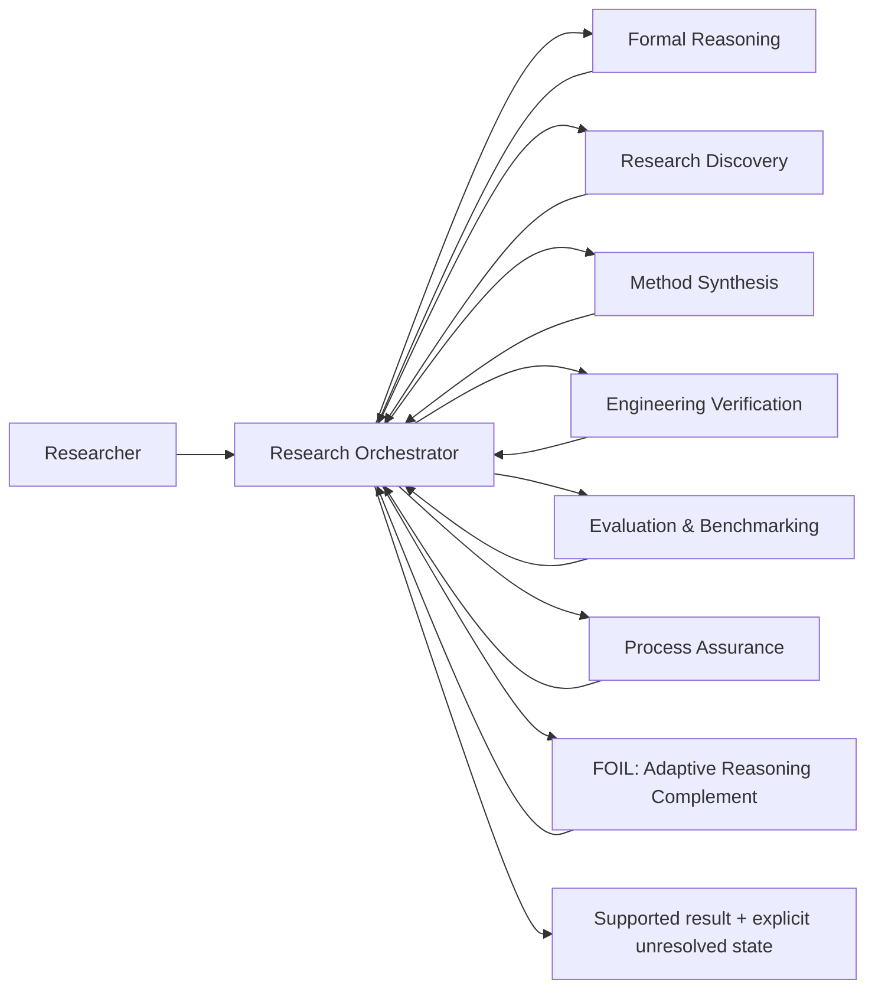

# Evidence-Governed Research Toolkit

**Modular research software for evidence-governed AI-assisted reasoning, verification, evaluation, process assurance, and adaptive assistance.**

[](https://github.com/Kitahl/The-Gauntlet/actions/workflows/validate.yml)
[](https://github.com/Kitahl/The-Gauntlet/actions/workflows/codeql.yml)
[](LICENSE)
[](CHANGELOG.md)

> **Research status:** public research-software toolkit with executable runtime checks, evidence-bearing structural/source validation, and exploratory benchmark pilots. The repository does **not** claim that the complete system improves human reasoning, scientific discovery, or general AI capability in prospective deployment.

**Demo:** https://kitahl.github.io/The-Gauntlet/  
**5-minute evaluator path:** [`docs/EVALUATOR_QUICKSTART.md`](docs/EVALUATOR_QUICKSTART.md)  
**Benchmark pilots:** [`docs/BENCHMARKS.md`](docs/BENCHMARKS.md) · **earlier blinded receipt:** [`benchmarks/results/2026-08-22-blinded-pilot.json`](benchmarks/results/2026-08-22-blinded-pilot.json) · **BrowseComp four-way receipt:** [`benchmark_runs/2026-08-22/browsecomp_four_way_results.json`](benchmark_runs/2026-08-22/browsecomp_four_way_results.json)  
**Runtime setup:** [`docs/RUNTIME_SETUP.md`](docs/RUNTIME_SETUP.md) · **FOIL onboarding:** [`docs/FOIL_ONBOARDING.md`](docs/FOIL_ONBOARDING.md) · **Deep calibration:** [`docs/FOIL_DEEP_CALIBRATION.md`](docs/FOIL_DEEP_CALIBRATION.md)  
**Research statement:** [`RESEARCH.md`](RESEARCH.md) · **Reproducibility:** [`REPRODUCIBILITY.md`](REPRODUCIBILITY.md) · **Roadmap:** [`ROADMAP.md`](ROADMAP.md)

---

## Why this project exists

AI-assisted research can fail even when the prose is persuasive, multiple agents agree, software tests are green, or a benchmark score is high. This project treats those signals as **evidence with scope**, not as automatic proof.

The core research question is:

> **Can a modular, evidence-governed reasoning workflow improve traceability, verification discipline, and independent usefulness in AI-assisted research without confusing confidence, consensus, or passing software checks with scientific validity?**

The toolkit routes work according to the **epistemic obligation**: what must be proved, searched, executed, measured, independently checked, or left unresolved.

## Exploratory benchmark pilots

The repository reports positive, null, and mixed/negative results. Earlier blinded pilots compare GPT-5.6 Sol `BASE` with the same underlying model using a frozen **Frontier-Exam FOIL + Mastermind** pre-commit procedure (`FOIL_MM`). A newer BrowseComp ablation separates `BASE`, generic `FOIL`, `FOIL_PROFILE`, and `FOIL_MM`. Because the conditions were executed in one conversation, items are deterministic **disjoint subsets**; these are exploratory estimates, not official submissions or isolated same-item causal A/B tests.

| Evaluation | BASE | Assisted condition | Delta | Status |
|---|---:|---:|---:|---|
| **HLE public text-only subset** | 1/6 · **16.7%** | FOIL_MM 2/6 · **33.3%** | **+16.7 pp** | blinded CI-scored pilot |
| **ARC-AGI-1 evaluation** | 4/6 · **66.7%** | FOIL_MM 5/6 · **83.3%** | **+16.7 pp** | blinded CI-scored pilot |
| **GPQA-Diamond** | 9/12 · **75.0%** | FOIL_MM 9/12 · **75.0%** | **0.0 pp** | blinded CI-scored pilot · **null result** |
| SimpleBench public subset | 3/5 · 60% | FOIL 5/5 · 100% | +40 pp | legacy manual pilot |
| Current-evidence retrieval holdout | 0/5 · 0% | FOIL 5/5 · 100% | +100 pp | custom mechanism holdout; not a standard benchmark |

**BrowseComp four-way exploratory ablation:**

| Condition | Correct / n | Exact-normalized accuracy |
|---|---:|---:|
| **BASE** | 1/2 | **50%** |
| **FOIL** | 2/2 | **100%** |
| **FOIL_PROFILE** | 1/2 | **50%** |
| **FOIL_MM** | 0/2 | **0%** |

The BrowseComp result is **not** evidence that generic FOIL is generally superior or that Mastermind is generally harmful: there are only two different scored items per condition, several complete pre-commit blocks were retired for contamination or execution-integrity reasons, and the exploratory scorer uses normalized exact string match rather than the official BrowseComp LLM judge.

**Do not combine these rows into a single headline accuracy.** Samples are small and the evaluations measure different constructs. Null, negative, and mixed outcomes are retained because the research question is whether mechanisms help, not whether every benchmark can be made to show an improvement. Several math/error-localization pilots were also discarded when BASE saturated at or near 100%, rather than being used as non-discriminating evidence.

Methodology, exclusions, sources, reproduction commands, and validity boundaries: **[`docs/BENCHMARKS.md`](docs/BENCHMARKS.md)**.

## Architecture



Full architecture and evidence flow: [`docs/ARCHITECTURE.md`](docs/ARCHITECTURE.md).

## Research modules

Professional display names are used for the research portfolio. Existing technical IDs and slash-command aliases are retained for backwards compatibility.

| Research module | Technical ID / alias | Responsibility |
|---|---|---|
| **Research Orchestrator** | `soul`, `/soul` | Frame, decompose, route, integrate, audit, release |
| **Formal Reasoning** | `mathbot`, `/mind` | Proof, logic, probability/statistics, counterexamples, formalization |
| **Research Discovery** | `scoutbot`, `/space` | Literature, prior art, existing software, cross-domain terminology |
| **Method Synthesis** | `novelbot`, `/reality` | New mechanisms only after known methods fail a named constraint |
| **Engineering Verification** | `codebot`, `/power` | Architecture, implementation, integration, execution, software verification |
| **Evaluation & Benchmarking** | `benchbot`, `/time` | Baselines, capability measurement, ceilings, cost, stop/go |
| **Process Assurance Framework** | `infinity-gauntlet`, `/gauntlet` | Frame/process audit, stale-state checks, inherited-number checks, false-green defense |
| **Decision Preflight Protocol** | `meditate` | Grounding before consequential decisions and after failures |
| **Evidence Review Panel** | `council-of-elders`, `/council` | Selective independent evidence/method review with matched control |
| **FOIL — Adaptive Reasoning Complement** | `foil`, `/foil` | User/task-specific missing-method support, multi-stage calibration, and independent-transfer tracking |

Every `skills/<id>/` directory contains **`SKILL.md` only**. Hooks, executable helpers, state policy, profiles, and benchmark harnesses deliberately live elsewhere.

## Executable runtime

Version 0.2.0 introduced the portable runtime. Version 0.3.0 added adaptive real-work deep calibration. Version 0.4.0 added a reproducible structured calibration layer for previously unknown users. Version 0.5.0 hardens release security, privacy, reproducibility, dependency identity, and cross-platform CI without changing FOIL's Layer 1 / Layer 2A / Layer 2B architecture.

**Version 0.5.1** is a research-repair release. It replaces FOIL's non-monotone competence count rule with a Beta-posterior estimator carrying evidence tiers and a recency weight (`tools/foil_evidence.py`, characterized in [`docs/FOIL_EVIDENCE_ESTIMATOR.md`](docs/FOIL_EVIDENCE_ESTIMATOR.md)); makes the assistance ladder, execution-ownership axis, and gap vocabulary generated contracts that fail a test on drift; states honestly that the frozen-run tool budget is a tamper-evident ledger enforced only under the PreToolUse broker and advisory everywhere else; replaces a lock that was not a lock with real kernel byte-range locks; ports the V2 routing kernel into `tools/foil_policy.py`, where the routing regime comes from task properties and a benchmark name is receipt metadata only; and makes the language model itself a configured capability via provider-neutral adapters. It closes no efficacy question — retrieval and personalization quality remain `NOT_MEASURED`. Full defect disposition (D1–D11), the not-adopted list, and the corrected vNext evidence boundary are in [`CHANGELOG.md`](CHANGELOG.md).

- `.claude/settings.json` — shareable Claude Code hooks using `${CLAUDE_PROJECT_DIR}`;
- `.gauntlet.json` — configurable governing files, audit budgets, optional evidence-ledger policy;
- `tools/gauntlet_monitor.py` — stale governing-state detection;
- `tools/gauntlet_boundary.py` — Stop-hook `frame` / `costume` boundary checks;
- `tools/gauntlet_hook.py` — Pre/Post tool integration;
- `tools/verify_ledger.py` — optional generic evidence-ledger commit gate;
- `tools/openrouter_bot.py`, `tools/fsa_bots.py`, `tools/snap.py` — optional model-backed independent review;
- `tools/foil_profile.py` / `tools/foil_hook.py` — persistent profiles and prompt-time domain/facet relevance adaptation;
- `tools/foil_assessment.py` — Layer 1 blank cold-start domain questionnaire;
- `tools/foil_layer2.py` — Layer 2A structured cross-cutting stranger calibration;
- `tools/foil_calibration.py` — Layer 2B transfer/adversarial/real-work deep calibration;
- `tools/foil_domains.py` — expanded non-diagnostic domain-relevance recognition.

Runtime state is written under gitignored `.egrt/state/`, not `.git/`. Model credentials are environment-only. No private workstation path or project-specific keystore is required.

## FOIL profiles and multi-stage calibration

FOIL contains no built-in profile for any individual. A first hooked session creates a **blank local `default` profile** when needed; named profiles support multiple users on one installation.

Profiles are stored outside the repository by default and record evidence metadata rather than raw prompts. Topic or facet mentions can change routing relevance without changing competence classification.

### Layer 1 — broad cold start

The onboarding screen includes:

- 20 generated objective probes across quantitative reasoning, formal reasoning, probability/statistics, causal inference, software engineering, systems/reliability, research/evidence literacy, scientific method, security/privacy, and planning/decision-making;
- context/goals, work-style preferences, self-estimates, and confidence calibration;
- open design/UX, creativity, and explanation tasks;
- dynamic setup/usage domains, including arbitrary custom domains.

### Layer 2A — structured cross-cutting calibration

The stranger-facing second screen adds:

- 24 objective micro-scenarios in standard mode;
- two observations across 12 cross-cutting reasoning facets;
- a 12-item short screening mode that cannot classify a facet from one response;
- confidence calibration and self-estimates kept separate from observed performance;
- open design, mechanism-diversity/creativity, and explanation tasks that remain rubric-reviewed.

The objective facets include formalization precision, decomposition/systems reasoning, error detection, evidence discipline, causal/quantitative reasoning, implementation/execution, planning/prioritization, metacognitive calibration, transfer/adaptation, verifier/tool selection, and uncertainty management.

### Layer 2B — adaptive real-work calibration

The saved profile then drives a profile-specific plan containing:

- changed-representation discriminators for uncertain/gap hypotheses;
- harder transfer probes for apparent strengths;
- adversarial/error-detection checks;
- real-work/artifact samples;
- design and creative production;
- explanation/teach-back;
- verifier/tool-selection probes;
- confidence-before-feedback;
- domain-specific follow-up.

Open-ended outcomes only count as verified when an appropriate rubric, artifact, proof, execution, or independent reviewer supports the result. A perfect Layer 2A screen alone cannot satisfy the deep-profile real-work coverage gates.

The personalizer is an **experimental onboarding/calibration system**, not an IQ, personality, clinical, diagnostic, aptitude, or employment test. See [`research/FOIL_PERSONALIZATION_BASIS.md`](research/FOIL_PERSONALIZATION_BASIS.md).

## What is currently supported by evidence

| Claim | Evidence status | Where to inspect |
|---|---|---|
| Process Assurance hooks/tools are portable, config-driven, and state-isolated | release-gated source/runtime checks | `validation/RUNTIME_FOIL_MASTERMIND_AUDIT.md`, `tests/` |
| Public skill directories contain `SKILL.md` only and private-lineage regressions are tested | release-gated checks | `tests/test_skill_layout.py`, `tests/test_private_leaks.py` |
| FOIL Layer 1 saved-profile/questionnaire mechanics enforce conservative initial classifications | release-gated tests | `tests/test_runtime_tools.py`, `tests/test_foil_assessment.py` |
| FOIL Layer 2A has blank-session, answer-isolation, assistance, confidence, and no-false-deep regressions | release-gated tests | `tests/test_foil_layer2.py` |
| FOIL Layer 2B mechanics enforce transfer breadth, independent verification, duplicate protection, and multi-domain maturity gates | release-gated tests | `tests/test_foil_calibration.py` |
| FOIL structured-calibration falsification history is preserved | audit record | `validation/FOIL_LAYER2_MASTERMIND_AUDIT.md` |
| FOIL research-integration structure/source/regression checks passed the recorded validator | **94/94 PASS** | `validation/FOIL_RESEARCH_INTEGRATION_VALIDATION.json` |
| FOIL frozen behavioral-contract cases are represented in the specification | **18/18 PASS-SPEC** | `validation/FOIL_RESEARCH_INTEGRATION_BEHAVIORAL_CONTRACT_VALIDATION.json` |
| HLE/ARC/GPQA/BrowseComp pilot score receipts exist under blinded question-generation/scoring harnesses | exploratory benchmark evidence | `docs/BENCHMARKS.md`, `benchmarks/results/2026-08-22-blinded-pilot.json`, `benchmark_runs/2026-08-22/browsecomp_four_way_results.json` |
| Public claims have a machine-readable provenance map | implemented | `docs/content-provenance.json` |
| FOIL improves independent human reasoning in deployment | **not established** | planned in `ROADMAP.md` |

`PASS-SPEC` means the specification contains the required decision behavior; it is not a behavioral execution result. Benchmark pilots measure model-output accuracy under particular benchmark protocols; they are not evidence of human learning efficacy.

## Quick evaluation

### 1. Clone and create an isolated environment

```bash
git clone https://github.com/Kitahl/The-Gauntlet.git
cd The-Gauntlet
python -m venv .venv
```

Activate the environment for your shell, then install the exact hash-locked development + runtime environment:

```bash
python -m pip install --upgrade pip
python -m pip install --require-hashes -r requirements-lock.txt
python -m playwright install chromium
```

### 2. Run the reproducible public checks

```bash
ruff check validation tools tests benchmarks/harness
python -m unittest discover -s tests -v
python validation/validate_soul_gauntlet_public.py
python validation/validate_showcase.py
python -m compileall -q validation tools tests benchmarks/harness
```

For interpretation and evidence boundaries, read [`REPRODUCIBILITY.md`](REPRODUCIBILITY.md).

### 3. Optional FOIL stranger calibration

```bash
python tools/foil_assessment.py start --out foil_assessment.json --responses foil_responses.json
```

Complete and apply Layer 1 to a saved profile, then run the structured Layer 2A screen:

```bash
python tools/foil_layer2.py start --profile default --mode standard \
  --out foil_layer2.json --responses foil_layer2_responses.json
python tools/foil_layer2.py score foil_layer2.json foil_layer2_responses.json \
  --profile default --out foil_layer2_report.json
```

Then generate the profile-specific Layer 2B real-work/transfer plan:

```bash
python tools/foil_calibration.py start --profile default --out foil_deep_calibration.json
python tools/foil_calibration.py status --profile default
```

Full instructions: [`docs/FOIL_ONBOARDING.md`](docs/FOIL_ONBOARDING.md) and [`docs/FOIL_DEEP_CALIBRATION.md`](docs/FOIL_DEEP_CALIBRATION.md).

## Research methodology

The repository separates:

1. **Generation** — candidate reasoning, methods, code, hypotheses.
2. **Evidence acquisition** — primary sources, formal derivations, executable observations, benchmarks.
3. **Verification** — a verifier matched to the exact claim and failure mode.
4. **Assurance** — process/frame audits that attack what ordinary candidate review can miss.
5. **Evaluation** — strong baselines, matched budgets, ablations, uncertainty, and negative results.
6. **Human learning** — assisted performance kept distinct from later independent ownership and transfer.

Planned behavioral comparisons include strong direct AI, static rules, adaptive FOIL, Layer 1-only vs Layer 1 + Layer 2A vs full Layer 2B, module ablations, native verification vs same-model critique, and Evidence Review Panel vs matched-evidence direct control. See [`RESEARCH.md`](RESEARCH.md).

## Repository structure

```text
.
├── skills/                  # specification-only modules: SKILL.md per directory
├── tools/                   # portable runtime helpers
├── benchmarks/              # blinded benchmark protocols, harnesses, permanent receipts
├── .claude/settings.json    # project hook wiring
├── .gauntlet.json           # Process Assurance runtime policy
├── research/                # research basis and source records
├── validation/              # deterministic/specification evidence
├── tests/                   # runtime, privacy, layout, questionnaire/calibration regressions
├── docs/                    # architecture, benchmark, runtime/onboarding docs, public showcase
├── .github/                 # CI, CodeQL, benchmark workflow, Dependabot, issue/PR forms
├── RESEARCH.md              # question, method, baselines, ablations
├── REPRODUCIBILITY.md       # exact reproduction/evidence protocol
├── ROADMAP.md               # evidence-first research roadmap
├── CITATION.cff             # GitHub/software citation metadata
├── CHANGELOG.md             # release history
├── CONTRIBUTING.md          # contribution/research mechanism standards
├── SECURITY.md              # vulnerability reporting
└── LICENSE                  # MIT license
```

## Research integrity principles

- User authority governs voluntary goals and actions; evidence governs factual warrant.
- A citation must support the exact claim and scope being relied on.
- A green test suite certifies only the properties it actually observes.
- Multi-agent agreement is not independent verification by itself.
- Novelty and absence claims are scoped to searched evidence.
- Negative results and failed mechanisms are retained when they change the credible search space.
- Behavioral efficacy is not inferred from specification correctness.
- Benchmark improvements are not generalized beyond their exact protocol and sample.
- User-profile relevance is not competence evidence; one miss never creates a permanent weakness.
- A deep profile requires evidence breadth; repeated success in one narrow task family is insufficient.
- A structured questionnaire may accelerate cold start but does not replace real-work and transfer evidence.

## Citation

GitHub exposes citation information from [`CITATION.cff`](CITATION.cff). Cite the exact release or commit used. A DOI will be added after the first evidence-bearing stable release is archived.

## Contributing and governance

See [`CONTRIBUTING.md`](CONTRIBUTING.md), [`GOVERNANCE.md`](GOVERNANCE.md), [`CODE_OF_CONDUCT.md`](CODE_OF_CONDUCT.md), and [`SECURITY.md`](SECURITY.md).

Bug reports, research-mechanism proposals, and independent reproductions have separate structured issue forms so evidence is captured consistently.

## License

MIT License. See [`LICENSE`](LICENSE).
