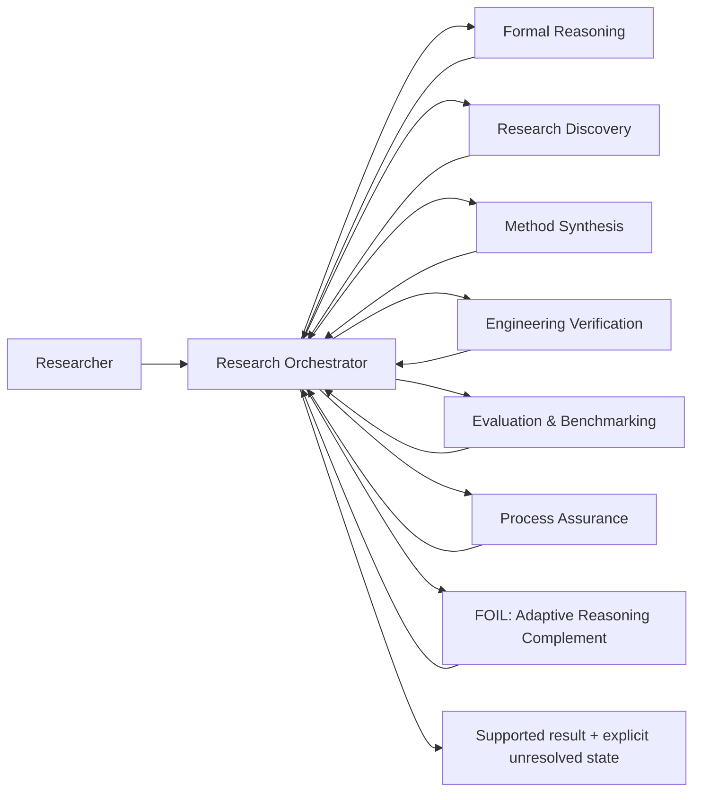

# Evidence-Governed Research Toolkit

**Modular research software for evidence-governed AI-assisted reasoning, verification, evaluation, process assurance, and adaptive assistance.**

[](https://github.com/Kitahl/The-Gauntlet/actions/workflows/validate.yml)
[](https://github.com/Kitahl/The-Gauntlet/actions/workflows/codeql.yml)
[](LICENSE)
[](CHANGELOG.md)

> **Research status:** public research-software toolkit with executable runtime checks and evidence-bearing structural/source validation. The repository does **not** yet claim that the complete system improves human reasoning, scientific discovery, or general AI capability in prospective deployment.

**Demo:** https://kitahl.github.io/The-Gauntlet/  
**5-minute evaluator path:** [`docs/EVALUATOR_QUICKSTART.md`](docs/EVALUATOR_QUICKSTART.md)  
**Runtime setup:** [`docs/RUNTIME_SETUP.md`](docs/RUNTIME_SETUP.md) · **FOIL onboarding:** [`docs/FOIL_ONBOARDING.md`](docs/FOIL_ONBOARDING.md) · **Deep calibration:** [`docs/FOIL_DEEP_CALIBRATION.md`](docs/FOIL_DEEP_CALIBRATION.md) · **Universal refinement:** [`docs/FOIL_UNIVERSAL_REFINEMENT.md`](docs/FOIL_UNIVERSAL_REFINEMENT.md)  
**Research statement:** [`RESEARCH.md`](RESEARCH.md) · **Reproducibility:** [`REPRODUCIBILITY.md`](REPRODUCIBILITY.md) · **Roadmap:** [`ROADMAP.md`](ROADMAP.md)

---

## Why this project exists

AI-assisted research can fail even when prose is persuasive, multiple agents agree, software tests are green, or a benchmark score is high. This project treats those signals as **evidence with scope**, not as automatic proof.

The core research question is:

> **Can a modular, evidence-governed reasoning workflow improve traceability, verification discipline, and independent usefulness in AI-assisted research without confusing confidence, consensus, or passing software checks with scientific validity?**

The toolkit routes work according to the **epistemic obligation**: what must be proved, searched, executed, measured, independently checked, or left unresolved.

## Architecture



Full architecture and evidence flow: [`docs/ARCHITECTURE.md`](docs/ARCHITECTURE.md).

## Research modules

Professional display names are used for the research portfolio. Existing technical IDs and slash-command aliases are retained for backwards compatibility.

| Research module | Technical ID / alias | Responsibility |
|---|---|---|
| **Research Orchestrator** | `soul`, `/soul` | Frame, decompose, route, integrate, audit, release |
| **Formal Reasoning** | `mathbot`, `/mind` | Proof, logic, probability/statistics, counterexamples, formalization |
| **Research Discovery** | `scoutbot`, `/space` | Literature, prior art, existing software, cross-domain terminology |
| **Method Synthesis** | `novelbot`, `/reality` | New mechanisms only after known methods fail a named constraint |
| **Engineering Verification** | `codebot`, `/power` | Architecture, implementation, integration, execution, software verification |
| **Evaluation & Benchmarking** | `benchbot`, `/time` | Baselines, capability measurement, ceilings, cost, stop/go |
| **Process Assurance Framework** | `infinity-gauntlet`, `/gauntlet` | Frame/process audit, stale-state checks, inherited-number checks, false-green defense |
| **Decision Preflight Protocol** | `meditate` | Grounding before consequential decisions and after failures |
| **Evidence Review Panel** | `council-of-elders`, `/council` | Selective independent evidence/method review with matched control |
| **FOIL — Adaptive Reasoning Complement** | `foil`, `/foil` | User/task-specific missing-method support, four-stage stranger calibration, and independent-transfer tracking |

Every `skills/<id>/` directory contains **`SKILL.md` only**. Hooks, executable helpers, state policy, and profiles deliberately live elsewhere.

## Executable runtime

- `.claude/settings.json` — shareable Claude Code hooks using `${CLAUDE_PROJECT_DIR}`;
- `.gauntlet.json` — configurable governing files, audit budgets, optional evidence-ledger policy;
- `tools/gauntlet_monitor.py` — stale governing-state detection;
- `tools/gauntlet_boundary.py` — Stop-hook `frame` / `costume` boundary checks;
- `tools/gauntlet_hook.py` — Pre/Post tool integration;
- `tools/verify_ledger.py` — optional generic evidence-ledger commit gate;
- `tools/openrouter_bot.py`, `tools/fsa_bots.py`, `tools/snap.py` — optional model-backed independent review;
- `tools/foil_profile.py` / `tools/foil_hook.py` — persistent profiles and prompt-time domain/facet/policy adaptation;
- `tools/foil_assessment.py` — Layer 1 broad cold-start questionnaire;
- `tools/foil_layer2.py` — Layer 2A structured cross-cutting stranger calibration;
- `tools/foil_calibration.py` — Layer 2B real-work/transfer/adversarial calibration;
- `tools/foil_equalizer.py` — Layer 2C universal evidence equalizer and task-policy compiler;
- `tools/foil_domains.py` — open-ended non-diagnostic domain-relevance recognition.

Runtime state is written under gitignored `.egrt/state/`, not `.git/`. Model credentials are environment-only. No private workstation path or project-specific keystore is required.

## FOIL: four-stage stranger personalization

FOIL contains no built-in profile for any individual. A first hooked session creates a **blank local `default` profile** when needed; named profiles support multiple users on one installation. Profiles are stored outside the repository and record evidence metadata rather than raw prompts.

### Layer 1 — broad cold start

`tools/foil_assessment.py`

- 20 generated objective probes across broad reasoning/research/engineering domains;
- goals/context, work-style preferences, self-estimates, confidence;
- open design/UX, creativity, and explanation tasks;
- dynamic custom domains.

Layer 1 produces only provisional hypotheses.

### Layer 2A — structured cross-cutting calibration

`tools/foil_layer2.py`

- 24 objective micro-scenarios in standard mode;
- two observations across 12 cross-cutting facets;
- short screening mode that cannot classify from one response;
- open design/creative/explanation tasks kept rubric-reviewed.

### Layer 2B — adaptive real-work calibration

`tools/foil_calibration.py`

- changed-representation discriminators;
- harder transfer probes for apparent strengths;
- adversarial/error detection;
- real-work/artifact samples;
- design/creative production;
- explanation/teach-back;
- verifier/tool-selection probes;
- confidence-before-feedback.

### Layer 2C — universal evidence equalizer

`tools/foil_equalizer.py`

Layer 2C prevents a stranger from receiving an apparently deep profile merely because one narrow capability was sampled repeatedly. It balances **distinct independently verified evidence** across:

- reasoning / representation;
- epistemic / scientific judgment;
- systems / execution;
- creation / communication;
- strategy / integration;
- learning / metacognition.

It adds evidence for verbal qualifier preservation, structural/spatial reasoning, data interpretation, experimental design, benchmark validity, interface integration, synthesis, learning diagnosis, confidence/help calibration, and delayed retention.

The highest-fidelity state requires broad family/domain/representation coverage, transfer, real-work evidence when relevant, adversarial/error-detection evidence, confidence-bearing results, and at least one **time-separated unassisted retrieval** result. It cannot be earned entirely in one immediate questionnaire sitting.

Layer 2C also compiles profile evidence into current-task policy: support mode, verification intensity, pedagogical friction, preferred verifier type, and whether a diagnostic probe is worth the burden.

**Verification intensity and pedagogical friction are separate controls.** A high-stakes urgent task may require maximum verification and minimal learner friction.

The personalizer remains an **experimental onboarding/calibration system**, not an IQ, personality, clinical, diagnostic, aptitude, or employment test. See [`research/FOIL_PERSONALIZATION_BASIS.md`](research/FOIL_PERSONALIZATION_BASIS.md) and [`research/FOIL_UNIVERSAL_REFINEMENT_BASIS.md`](research/FOIL_UNIVERSAL_REFINEMENT_BASIS.md).

## What is currently supported by evidence

| Claim | Evidence status | Where to inspect |
|---|---|---|
| Process Assurance hooks/tools are portable, config-driven, and state-isolated | release-gated source/runtime checks | `validation/RUNTIME_FOIL_MASTERMIND_AUDIT.md`, `tests/` |
| Public skill directories contain `SKILL.md` only and private-lineage regressions are tested | release-gated checks | `tests/test_skill_layout.py`, `tests/test_private_leaks.py` |
| FOIL Layer 1 saved-profile/questionnaire mechanics enforce conservative initial classifications | release-gated tests | `tests/test_runtime_tools.py`, `tests/test_foil_assessment.py` |
| FOIL Layer 2A has blank-session, answer-isolation, assistance, confidence, and no-false-deep regressions | release-gated tests | `tests/test_foil_layer2.py` |
| FOIL Layer 2B enforces transfer breadth, independent verification, duplicate protection, and multi-domain maturity | release-gated tests | `tests/test_foil_calibration.py` |
| FOIL Layer 2C enforces distinct-family coverage, delayed retention, issued-probe integrity, and task-policy boundaries | release-gated tests | `tests/test_foil_equalizer.py` |
| FOIL research-integration structure/source/regression checks passed the recorded validator | **94/94 PASS** | `validation/FOIL_RESEARCH_INTEGRATION_VALIDATION.json` |
| FOIL frozen behavioral-contract cases are represented in the specification | **18/18 PASS-SPEC** | `validation/FOIL_RESEARCH_INTEGRATION_BEHAVIORAL_CONTRACT_VALIDATION.json` |
| FOIL improves independent human reasoning in deployment | **not established** | planned in `ROADMAP.md` |

`PASS-SPEC` means the specification contains the required decision behavior; it is not a behavioral execution result.

## Quick evaluation

```bash
git clone https://github.com/Kitahl/The-Gauntlet.git
cd The-Gauntlet
python -m venv .venv
# activate .venv
python -m pip install --upgrade pip
python -m pip install -r requirements-dev.txt -r requirements-runtime.txt
python -m playwright install chromium
ruff check validation tools tests
python -m unittest discover -s tests -v
python validation/validate_soul_gauntlet_public.py
python validation/validate_showcase.py
python -m compileall -q validation tools tests
```

### Optional FOIL stranger path

```bash
python tools/foil_assessment.py start --out foil_assessment.json --responses foil_responses.json
# fill responses, then score/apply Layer 1
python tools/foil_layer2.py start --profile default --mode standard \
  --out foil_layer2.json --responses foil_layer2_responses.json
python tools/foil_layer2.py score foil_layer2.json foil_layer2_responses.json \
  --profile default --out foil_layer2_report.json
python tools/foil_calibration.py start --profile default --out foil_deep_calibration.json
python tools/foil_equalizer.py start --profile default --out foil_equalizer_plan.json
python tools/foil_equalizer.py status --profile default
```

Full instructions: [`docs/FOIL_ONBOARDING.md`](docs/FOIL_ONBOARDING.md), [`docs/FOIL_DEEP_CALIBRATION.md`](docs/FOIL_DEEP_CALIBRATION.md), and [`docs/FOIL_UNIVERSAL_REFINEMENT.md`](docs/FOIL_UNIVERSAL_REFINEMENT.md).

## Research integrity principles

- User authority governs voluntary goals/actions; evidence governs factual warrant.
- A citation must support the exact claim and scope relied on.
- A green test suite certifies only what it observes.
- Multi-agent agreement is not independent verification by itself.
- Negative results and failed mechanisms are retained when they change the credible search space.
- User-profile relevance is not competence evidence; one miss never creates a permanent weakness.
- Assisted or unverified success does not establish independent competence.
- Repeated success in one narrow task family is insufficient for a high-fidelity stranger profile.
- Preferences tune interaction style; they are not aptitude/learning-style evidence.
- Highest-fidelity personalization requires time-separated independent evidence and remains superseded by newer real-work observations.

## Repository structure

```text
.
├── skills/                  # specification-only modules: SKILL.md per directory
├── tools/                   # portable runtime helpers
├── .claude/settings.json    # project hook wiring
├── .gauntlet.json           # Process Assurance runtime policy
├── research/                # research basis and source records
├── validation/              # deterministic/specification evidence
├── tests/                   # runtime, privacy, layout, calibration regressions
├── docs/                    # architecture, runtime/onboarding docs, showcase
├── .github/                 # CI, CodeQL, Dependabot, issue/PR forms
├── RESEARCH.md
├── REPRODUCIBILITY.md
├── ROADMAP.md
├── CITATION.cff
├── CHANGELOG.md
├── CONTRIBUTING.md
├── SECURITY.md
└── LICENSE
```

## Citation

GitHub exposes citation information from [`CITATION.cff`](CITATION.cff). Cite the exact release or commit used. A DOI will be added after the first evidence-bearing stable release is archived.

## Contributing and governance

See [`CONTRIBUTING.md`](CONTRIBUTING.md), [`GOVERNANCE.md`](GOVERNANCE.md), [`CODE_OF_CONDUCT.md`](CODE_OF_CONDUCT.md), and [`SECURITY.md`](SECURITY.md).

## License

MIT License. See [`LICENSE`](LICENSE).
