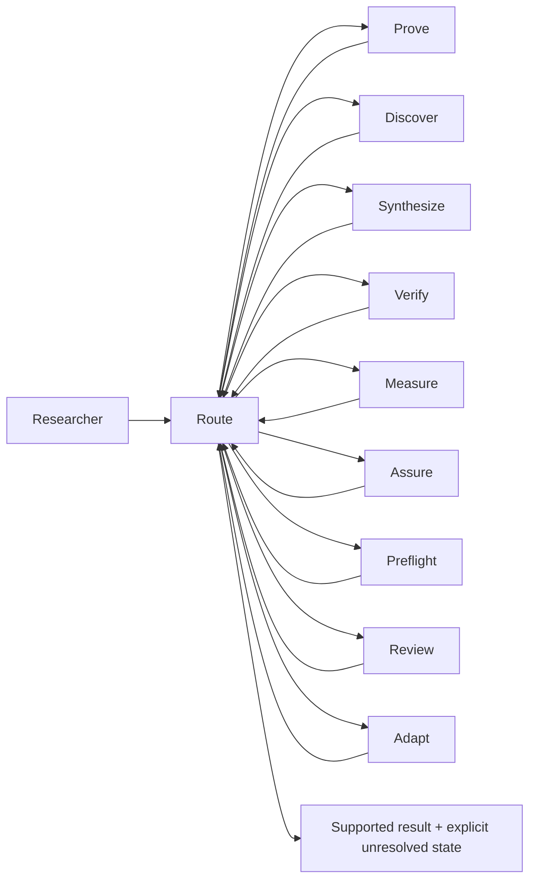

# Rigilum — Instrument 01

**Pre-product preview · free research software · version 0.5.1**

Instrument 01 is a coordinated research-software suite for AI-assisted technical work where evidence, verification, reproducibility, and explicit unresolved state matter.

> **Brand status:** `Rigilum` is the working company identity selected by the August 25, 2026 three-loop naming and product-architecture audit in this repository. It is **not** represented as trademark, corporate-name, or domain clearance. The repository slug, technical IDs, slash commands, runtime modules, benchmark condition names, and historical records remain unchanged until a separate clearance and migration decision is made.

[](https://github.com/Kitahl/The-Gauntlet/actions/workflows/validate.yml)
[](https://github.com/Kitahl/The-Gauntlet/actions/workflows/codeql.yml)
[](LICENSE)
[](CHANGELOG.md)

**Preview:** https://kitahl.github.io/The-Gauntlet/  
**5-minute evaluator path:** [`docs/EVALUATOR_QUICKSTART.md`](docs/EVALUATOR_QUICKSTART.md)  
**Architecture:** [`docs/ARCHITECTURE.md`](docs/ARCHITECTURE.md)  
**Benchmarks:** [`docs/BENCHMARKS.md`](docs/BENCHMARKS.md)  
**Research statement:** [`RESEARCH.md`](RESEARCH.md)  
**Reproducibility:** [`REPRODUCIBILITY.md`](REPRODUCIBILITY.md)

---

## The first instrument

Research workflows often fail at the handoffs: deciding what needs proof, what needs current evidence, what needs implementation, what needs measurement, what should be independently challenged, and what must remain unresolved.

Instrument 01 puts those obligations behind one coordinated surface. Its public modules are named for the job they perform:

| Instrument 01 module | Responsibility | Stable technical ID / command |
|---|---|---|
| **Route** | Frame work, decompose it, route obligations, integrate evidence, and govern release | `soul` · `/soul` |
| **Prove** | Formal reasoning, mathematics, probability, statistics, counterexamples, and proof structure | `mathbot` · `/mind` |
| **Discover** | Literature, prior art, existing software, current evidence, and cross-domain terminology | `scoutbot` · `/space` |
| **Synthesize** | Construct new mechanisms only after known methods fail a named constraint | `novelbot` · `/reality` |
| **Verify** | Architecture, implementation, integration, execution, and software verification | `codebot` · `/power` |
| **Measure** | Baselines, capability measurement, ceilings, cost, ablations, and stop/go evidence | `benchbot` · `/time` |
| **Assure** | Process checks, stale-state detection, frame/costume boundaries, and false-green defense | `infinity-gauntlet` · `/gauntlet` |
| **Preflight** | Grounding before consequential decisions and after failures | `meditate` |
| **Review** | Selective independent evidence and method review | `council-of-elders` · `/council` |
| **Adapt** | Task- and user-specific complementary assistance with calibrated evidence about coverage | `foil` · `/foil` |

These are **public product names**, not runtime migrations. Existing integrations continue to use the stable identifiers in the right-hand column.

## Why a pre-product preview

Instrument 01 is being published before a commercial product exists for three reasons:

1. **Inspectability.** The architecture, source, validation logic, benchmark receipts, and known limitations can be examined directly.
2. **Falsifiability.** Positive, null, and mixed results remain visible rather than being reduced to a launch claim.
3. **Product discovery.** The preview can establish which parts of the suite are genuinely useful before packaging, hosted infrastructure, enterprise integrations, or paid support are designed.

The preview is free under the [`MIT License`](LICENSE). No hosted service, support SLA, commercial-readiness claim, or behavioral-efficacy claim is implied.

## Evidence boundary

The software includes executable runtime checks, structural/source validation, benchmark harnesses, and exploratory evaluation receipts. Those establish particular engineering facts. They do **not** establish that the complete suite improves human reasoning, scientific discovery, or general AI capability in prospective deployment.

The repository deliberately preserves null and negative evidence. Current benchmark artifacts and their validity boundaries are documented in [`docs/BENCHMARKS.md`](docs/BENCHMARKS.md). Prospective research obligations remain in [`ROADMAP.md`](ROADMAP.md).

## Architecture



The implementation retains the historical internal vocabulary used by the runtime and research record. In particular, the earlier public labels **Research Orchestrator**, **Formal Reasoning**, **Research Discovery**, **Method Synthesis**, **Engineering Verification**, **Evaluation & Benchmarking**, **Process Assurance Framework**, **Decision Preflight Protocol**, **Evidence Review Panel**, and **Mirror — Adaptive Reasoning Complement** are migration references rather than the new product-facing names. Mirror's technical skill name remains `foil`, its slash command remains `/foil`, its runtime modules remain `tools/foil_*`, and historical benchmark condition names remain unchanged.

## Quick evaluation

```bash
git clone https://github.com/Kitahl/The-Gauntlet.git
cd The-Gauntlet
python -m venv .venv
```

Activate the environment, then install the hash-locked development and runtime dependencies:

```bash
python -m pip install --upgrade pip
python -m pip install --require-hashes -r requirements-lock.txt
python -m playwright install chromium
```

Run the principal mechanical checks:

```bash
python -m pytest
python validation/validate_soul_gauntlet_public.py
python validation/validate_showcase.py
```

See [`docs/RUNTIME_SETUP.md`](docs/RUNTIME_SETUP.md) for runtime configuration and [`REPRODUCIBILITY.md`](REPRODUCIBILITY.md) for the interpretation boundary of these checks.

## Product and company decision record

The working identity was selected through three non-duplicative Mastermind loops:

- **Loop 1 — continuity:** tested **Sigma Scientific Systems** as the company umbrella and separated company identity from product identity.
- **Loop 2 — clean slate:** generated and collision-screened new company/product architectures rather than refining Sigma repeatedly.
- **Loop 3 — external comparison:** compared the survivors against the 2026 Nature Index top 100 corporate research institutions and selected the architecture that best balanced scientific credibility, distinctiveness, extensibility, and product/company separation.

The full decision record is [`validation/MASTERMIND_BRAND_PRODUCT_3_LOOP_REPORT_2026-08-25.md`](validation/MASTERMIND_BRAND_PRODUCT_3_LOOP_REPORT_2026-08-25.md).

## Release surfaces

- [`SECURITY.md`](SECURITY.md) — security policy
- [`GOVERNANCE.md`](GOVERNANCE.md) — governance
- [`CONTRIBUTING.md`](CONTRIBUTING.md) — contribution process
- [`CITATION.cff`](CITATION.cff) — machine-readable citation metadata
- [`CHANGELOG.md`](CHANGELOG.md) — software history
- [`ROADMAP.md`](ROADMAP.md) — research and engineering roadmap
- [`docs/content-provenance.json`](docs/content-provenance.json) — public claim provenance

**Rigilum / Instrument 01 is a working pre-product identity. Legal name availability, trademark clearance, domains, organization transfer, and final launch identity are separate gates.**
