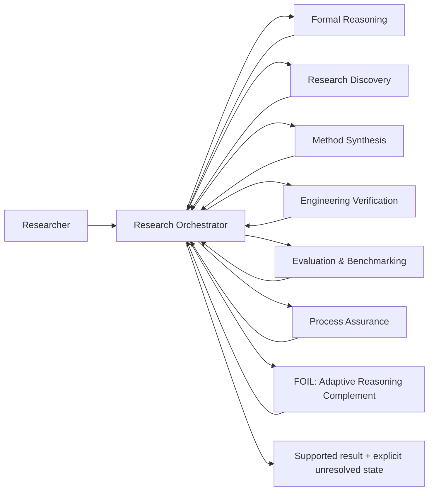

# Evidence-Governed Research Toolkit

**Modular research software for evidence-governed AI-assisted reasoning, verification, evaluation, process assurance, and adaptive assistance.**

[](https://github.com/Kitahl/The-Gauntlet/actions/workflows/validate.yml)
[](https://github.com/Kitahl/The-Gauntlet/actions/workflows/codeql.yml)
[](LICENSE)
[](CHANGELOG.md)

> **Research status:** public research-software toolkit with executable runtime checks and evidence-bearing structural/source validation. The repository does **not** yet claim that the complete system improves human reasoning, scientific discovery, or general AI capability in prospective deployment.

**Demo:** https://kitahl.github.io/The-Gauntlet/  
**5-minute evaluator path:** [`docs/EVALUATOR_QUICKSTART.md`](docs/EVALUATOR_QUICKSTART.md)  
**Runtime setup:** [`docs/RUNTIME_SETUP.md`](docs/RUNTIME_SETUP.md) · **FOIL onboarding:** [`docs/FOIL_ONBOARDING.md`](docs/FOIL_ONBOARDING.md)  
**Research statement:** [`RESEARCH.md`](RESEARCH.md) · **Reproducibility:** [`REPRODUCIBILITY.md`](REPRODUCIBILITY.md) · **Roadmap:** [`ROADMAP.md`](ROADMAP.md)

---

## Why this project exists

AI-assisted research can fail even when the prose is persuasive, multiple agents agree, software tests are green, or a benchmark score is high. This project treats those signals as **evidence with scope**, not as automatic proof.

The core research question is:

> **Can a modular, evidence-governed reasoning workflow improve traceability, verification discipline, and independent usefulness in AI-assisted research without confusing confidence, consensus, or passing software checks with scientific validity?**

The toolkit routes work according to the **epistemic obligation**: what must be proved, searched, executed, measured, independently checked, or left unresolved.

## Architecture



Full architecture and evidence flow: [`docs/ARCHITECTURE.md`](docs/ARCHITECTURE.md).

## Research modules

Professional display names are used for the research portfolio. Existing technical IDs and slash-command aliases are retained for backwards compatibility.

| Research module | Technical ID / alias | Responsibility |
|---|---|---|
| **Research Orchestrator** | `soul`, `/soul` | Frame, decompose, route, integrate, audit, release |
| **Formal Reasoning** | `mathbot`, `/mind` | Proof, logic, probability/statistics, counterexamples, formalization |
| **Research Discovery** | `scoutbot`, `/space` | Literature, prior art, existing software, cross-domain terminology |
| **Method Synthesis** | `novelbot`, `/reality` | New mechanisms only after known methods fail a named constraint |
| **Engineering Verification** | `codebot`, `/power` | Architecture, implementation, integration, execution, software verification |
| **Evaluation & Benchmarking** | `benchbot`, `/time` | Baselines, capability measurement, ceilings, cost, stop/go |
| **Process Assurance Framework** | `infinity-gauntlet`, `/gauntlet` | Frame/process audit, stale-state checks, inherited-number checks, false-green defense |
| **Decision Preflight Protocol** | `meditate` | Grounding before consequential decisions and after failures |
| **Evidence Review Panel** | `council-of-elders`, `/council` | Selective independent evidence/method review with matched control |
| **FOIL — Adaptive Reasoning Complement** | `foil`, `/foil` | User/task-specific missing-method support and independent-transfer tracking |

Every `skills/<id>/` directory contains **`SKILL.md` only**. Hooks, executable helpers, state policy, and profiles deliberately live elsewhere.

## Executable runtime

Version 0.2.0 adds a portable runtime around the specifications:

- `.claude/settings.json` — shareable Claude Code hooks using `${CLAUDE_PROJECT_DIR}`;
- `.gauntlet.json` — configurable governing files, audit budgets, optional evidence-ledger policy;
- `tools/gauntlet_monitor.py` — stale governing-state detection;
- `tools/gauntlet_boundary.py` — Stop-hook `frame` / `costume` boundary checks;
- `tools/gauntlet_hook.py` — Pre/Post tool integration;
- `tools/verify_ledger.py` — optional generic evidence-ledger commit gate;
- `tools/openrouter_bot.py`, `tools/fsa_bots.py`, `tools/snap.py` — optional model-backed independent review;
- `tools/foil_profile.py` / `tools/foil_hook.py` — persistent profiles and prompt-time relevance adaptation;
- `tools/foil_assessment.py` — blank adaptive onboarding questionnaire.

Runtime state is written under gitignored `.egrt/state/`, not `.git/`. Model credentials are environment-only. No private workstation path or project-specific keystore is required.

## FOIL profiles and onboarding

FOIL no longer contains a built-in profile for any individual. A first hooked session creates a **blank local `default` profile** when needed; named profiles support multiple users on one installation.

Profiles are stored outside the repository by default and record evidence metadata rather than raw prompts. Topic mentions can make a domain relevant to routing without changing its competence classification.

The onboarding screen currently includes:

- 20 generated objective probes across quantitative reasoning, formal reasoning, probability/statistics, causal inference, software engineering, systems/reliability, research/evidence literacy, scientific method, security/privacy, and planning/decision-making;
- context/goals, work-style preferences, self-estimates, and confidence calibration;
- open design/UX, creativity, and explanation tasks;
- dynamic setup/usage domains, including arbitrary custom domains.

The questionnaire is an **experimental onboarding instrument**, not an IQ, personality, clinical, diagnostic, or employment test. See [`research/FOIL_PERSONALIZATION_BASIS.md`](research/FOIL_PERSONALIZATION_BASIS.md).

## What is currently supported by evidence

| Claim | Evidence status | Where to inspect |
|---|---|---|
| Process Assurance hooks/tools are portable, config-driven, and state-isolated | release-gated source/runtime checks | `validation/RUNTIME_FOIL_MASTERMIND_AUDIT.md`, `tests/` |
| Public skill directories contain `SKILL.md` only and private-lineage regressions are tested | release-gated checks | `tests/test_skill_layout.py`, `tests/test_private_leaks.py` |
| FOIL saved-profile/questionnaire mechanics enforce conservative initial classifications | release-gated tests | `tests/test_runtime_tools.py`, `tests/test_foil_assessment.py` |
| FOIL research-integration structure/source/regression checks passed the recorded validator | **94/94 PASS** | `validation/FOIL_RESEARCH_INTEGRATION_VALIDATION.json` |
| FOIL frozen behavioral-contract cases are represented in the specification | **18/18 PASS-SPEC** | `validation/FOIL_RESEARCH_INTEGRATION_BEHAVIORAL_CONTRACT_VALIDATION.json` |
| Public claims have a machine-readable provenance map | implemented | `docs/content-provenance.json` |
| FOIL improves independent human reasoning in deployment | **not established** | planned in `ROADMAP.md` |

`PASS-SPEC` means the specification contains the required decision behavior; it is not a behavioral execution result.

## Quick evaluation

### 1. Clone and create an isolated environment

```bash
git clone https://github.com/Kitahl/The-Gauntlet.git
cd The-Gauntlet
python -m venv .venv
```

Activate the environment for your shell, then install pinned development + runtime dependencies:

```bash
python -m pip install --upgrade pip
python -m pip install -r requirements-dev.txt -r requirements-runtime.txt
python -m playwright install chromium
```

### 2. Run the reproducible public checks

```bash
ruff check validation tools tests
python -m unittest discover -s tests -v
python validation/validate_soul_gauntlet_public.py
python validation/validate_showcase.py
python -m compileall -q validation tools tests
```

For interpretation and evidence boundaries, read [`REPRODUCIBILITY.md`](REPRODUCIBILITY.md).

### 3. Optional FOIL onboarding

```bash
python tools/foil_assessment.py start --out foil_assessment.json --responses foil_responses.json
```

Complete the blank response file, then apply it to the automatically created `default` profile or a named profile. Full instructions: [`docs/FOIL_ONBOARDING.md`](docs/FOIL_ONBOARDING.md).

## Research methodology

The repository separates:

1. **Generation** — candidate reasoning, methods, code, hypotheses.
2. **Evidence acquisition** — primary sources, formal derivations, executable observations, benchmarks.
3. **Verification** — a verifier matched to the exact claim and failure mode.
4. **Assurance** — process/frame audits that attack what ordinary candidate review can miss.
5. **Evaluation** — strong baselines, matched budgets, ablations, uncertainty, and negative results.
6. **Human learning** — assisted performance kept distinct from later independent ownership and transfer.

Planned behavioral comparisons include strong direct AI, static rules, adaptive FOIL, module ablations, native verification vs same-model critique, and Evidence Review Panel vs matched-evidence direct control. See [`RESEARCH.md`](RESEARCH.md).

## Repository structure

```text
.
├── skills/                  # specification-only modules: SKILL.md per directory
├── tools/                   # portable runtime helpers
├── .claude/settings.json    # project hook wiring
├── .gauntlet.json           # Process Assurance runtime policy
├── research/                # research basis and source records
├── validation/              # deterministic/specification evidence
├── tests/                   # runtime, privacy, layout, questionnaire regressions
├── docs/                    # architecture, runtime/onboarding docs, public showcase
├── .github/                 # CI, CodeQL, Dependabot, issue/PR forms
├── RESEARCH.md              # question, method, baselines, ablations
├── REPRODUCIBILITY.md       # exact reproduction/evidence protocol
├── ROADMAP.md               # evidence-first research roadmap
├── CITATION.cff             # GitHub/software citation metadata
├── CHANGELOG.md             # release history
├── CONTRIBUTING.md          # contribution/research mechanism standards
├── SECURITY.md              # vulnerability reporting
└── LICENSE                  # MIT license
```

## Research integrity principles

- User authority governs voluntary goals and actions; evidence governs factual warrant.
- A citation must support the exact claim and scope being relied on.
- A green test suite certifies only the properties it actually observes.
- Multi-agent agreement is not independent verification by itself.
- Novelty and absence claims are scoped to searched evidence.
- Negative results and failed mechanisms are retained when they change the credible search space.
- Behavioral efficacy is not inferred from specification correctness.
- User-profile relevance is not competence evidence; one miss never creates a permanent weakness.

## Citation

GitHub exposes citation information from [`CITATION.cff`](CITATION.cff). Cite the exact release or commit used. A DOI will be added after the first evidence-bearing stable release is archived.

## Contributing and governance

See [`CONTRIBUTING.md`](CONTRIBUTING.md), [`GOVERNANCE.md`](GOVERNANCE.md), [`CODE_OF_CONDUCT.md`](CODE_OF_CONDUCT.md), and [`SECURITY.md`](SECURITY.md).

Bug reports, research-mechanism proposals, and independent reproductions have separate structured issue forms so evidence is captured consistently.

## License

MIT License. See [`LICENSE`](LICENSE).
