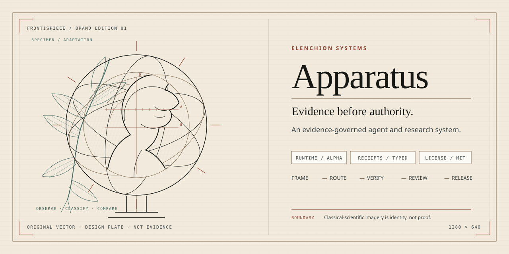
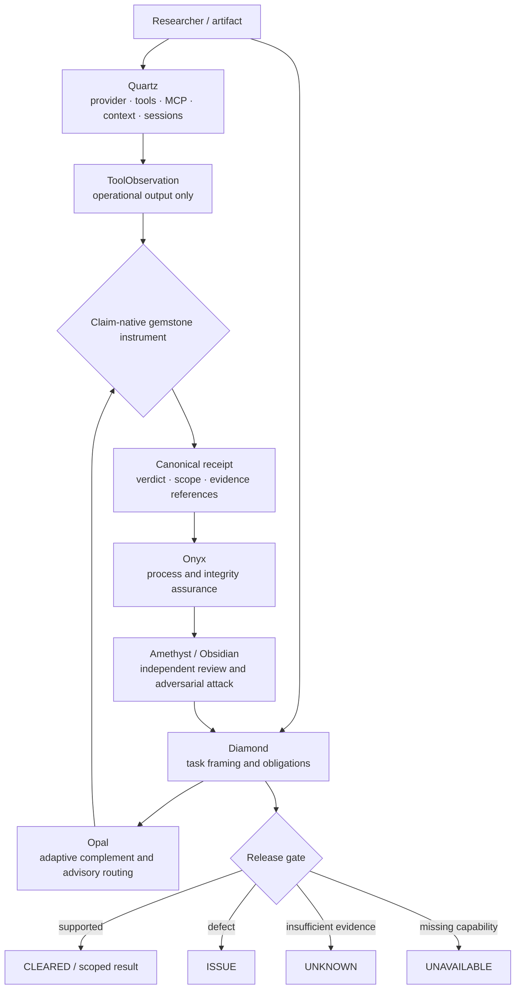

<p align="center">
  
</p>

# Prism

**An evidence-governed agent and research system by Lattice.**

[](https://github.com/Kitahl/The-Gauntlet/actions/workflows/validate.yml)
[](https://github.com/Kitahl/The-Gauntlet/actions/workflows/fastpath-checkpoint.yml)
[](https://github.com/Kitahl/The-Gauntlet/actions/workflows/codeql.yml)
[](LICENSE)
[](CHANGELOG.md)

> **Research status:** Prism is public research software with executable checks, typed evidence receipts, bounded benchmark pilots, and an interim Hermes-derived runtime alpha. It does **not** establish that the complete system improves human reasoning, scientific discovery, or general AI capability in prospective deployment.

**Website:** [kitahl.github.io/The-Gauntlet](https://kitahl.github.io/The-Gauntlet/)  
**5-minute evaluator path:** [`docs/EVALUATOR_QUICKSTART.md`](docs/EVALUATOR_QUICKSTART.md)  
**Architecture:** [`docs/ARCHITECTURE.md`](docs/ARCHITECTURE.md) · **Runtime alpha:** [`docs/engineering/PHASE8_USER_CLI_BOOT.md`](docs/engineering/PHASE8_USER_CLI_BOOT.md)  
**Benchmarks:** [`docs/BENCHMARKS.md`](docs/BENCHMARKS.md) · **Reproducibility:** [`REPRODUCIBILITY.md`](REPRODUCIBILITY.md) · **Research boundary:** [`RESEARCH.md`](RESEARCH.md)

---

## 1. Identity

| Layer | Public name | Meaning | Compatibility boundary |
|---|---|---|---|
| Organization | **Lattice** | One-word scientific identity: an ordered structure for research and engineering instruments | Naming decision only; no claim of legal incorporation, trademark clearance, or historical lineage |
| Product suite | **Prism** | One runtime, one evidence-control plane, and a portfolio of specialist gemstone instruments | Repository remains `Kitahl/The-Gauntlet`; the installed command remains `gauntlet` |
| Runtime | **Quartz** | Hermes-derived operational layer behind the evidence boundary | Technical runtime remains `gauntlet_host` |
| Product principle | **Evidence before authority** | Models and tools may produce observations; claim-native methods and receipts govern factual warrant | Existing task, obligation, receipt, verdict, and release semantics are unchanged |
| Visual language | **Scholarly Antiquarian Framing** | Classical, natural-history, mineralogical, and instrument imagery paired with modern evidence panels | Brand language is never evidence for a technical or scientific claim |

The gemstone names are public aliases. Existing commands, state, receipts, tests, files, and citations continue to resolve through the stable technical names. See [`docs/brand/NAMING_ARCHITECTURE.md`](docs/brand/NAMING_ARCHITECTURE.md).

## 2. What Prism does

Prism treats a claim like a specimen under examination:

1. **Frame** the goal and create explicit load-bearing obligations.
2. **Route** each obligation to the method that can actually establish it.
3. **Execute** models, tools, search, code, and verifiers through a bounded runtime.
4. **Record** observations and evidence as scoped, integrity-checked receipts.
5. **Challenge** the result through process assurance and independent review.
6. **Release** only the conclusion supported by the latest valid evidence state.

The system is intentionally asymmetric. A model may propose a route, call a tool, or draft an answer. It may not convert its own activity into proof or release its own claim.

## 3. System architecture



The governing path remains:

```text
runtime tool execution
→ ToolObservation
→ claim-native instrument or verifier
→ canonical Receipt
→ Diamond release gate
```

## 4. Quartz — Hermes-derived operational layer

**Quartz** is the public name for the interim runtime contained in `gauntlet_host/`. It vendors the exact pinned MIT-licensed Hermes Agent source and runs it as a Gauntlet-owned isolated subprocess rather than as a separately installed product.

### Included mechanisms

- provider selection and OpenAI-compatible model access;
- dynamic tool registration and tool execution;
- MCP integration inherited from the pinned runtime;
- context and session handling;
- operational memory and skill mechanisms with write approval;
- retries, interruption lifecycle, and delegation primitives;
- typed JSONL parent/worker communication;
- repository-bound task identity;
- `gauntlet` one-shot and `gauntlet chat` entry points;
- observation recording followed by the parent-owned release gate.

### Verified checkpoint

The recorded FAST-P8 checkpoint reports **8/8 bounded boot checks passed**: the command started, the isolated worker started, the model responded, a runtime tool executed, canonical task status was read, an observation-only record was written, the Soul release gate ran, and an unresolved task was not reported as cleared.

### Current boundary

Quartz remains an interim pinned-runtime alpha. The checkpoint did not qualify paid external providers, automatic claim-native execution, autonomous replanning, task release, profile-based complements, dynamic tool narrowing, cross-platform operation, or behavioral/cost benefit. Runtime, model, tool, plugin, memory, and session state remain **observation-only** with respect to factual authority.

Inspect the frozen source, attribution, and checkpoint:

- [`third_party/HERMES_SOURCE_LEDGER.md`](third_party/HERMES_SOURCE_LEDGER.md)
- [`vendor/HERMES_SNAPSHOT.json`](vendor/HERMES_SNAPSHOT.json)
- [`docs/engineering/GAUNTLET_FAST_BUILD_HERMES_INTERNAL_RUNTIME_2026-08-28.md`](docs/engineering/GAUNTLET_FAST_BUILD_HERMES_INTERNAL_RUNTIME_2026-08-28.md)
- [`docs/engineering/HERMES_FAST_P8_CHECKPOINT.json`](docs/engineering/HERMES_FAST_P8_CHECKPOINT.json)

## 5. The ten gemstone instruments

| Public instrument | Existing technical ID / command | Responsibility | Returns |
|---|---|---|---|
| **Diamond** | `soul`, `/soul` | Frame goals, create obligations, route work, integrate receipts, govern release | Supported result or explicit unresolved state |
| **Sapphire** | `mathbot`, `/mind` | Formalize and test mathematical, logical, probabilistic, and specification claims | Proof, counterexample, measured result, or unresolved obligation |
| **Emerald** | `scoutbot`, `/space` | Search literature, standards, prior art, repositories, and current sources | Source set, nearest established class, differentiator, and search limits |
| **Ruby** | `novelbot`, `/reality` | Construct a new mechanism only after a named constraint defeats established methods | Candidate mechanism, assumptions, failure modes, negative control, verifier plan |
| **Garnet** | `codebot`, `/power` | Implement and verify software through real entry points and defect classes | Executed checks, output hashes, coverage, and untested limits |
| **Topaz** | `benchbot`, `/time` | Design matched comparisons, baselines, ablations, uncertainty, and stop/go rules | Decision-relevant estimate with exclusions and uncertainty |
| **Onyx** | `infinity-gauntlet`, `/gauntlet` | Detect stale state, false greens, inherited numbers, scope errors, and process defects | Assurance findings and integrity events; never cosmetic approval |
| **Citrine** | `meditate` | Establish facts, assumptions, unknowns, options, blockers, and value of more computation | Decision preflight state and bounded next action |
| **Amethyst** | `council-of-elders`, `/council` | Run independent seats, commitment/reveal, cross-critique, and controlled synthesis | Review receipt with preserved disagreement and scope |
| **Opal** | `foil`, `/foil` | Identify the least-covered capability for this user and task, then request the smallest useful complement | Advisory route, complement, verifier requirements, and stop signal |

Every `skills/<technical-id>/` directory retains `SKILL.md` as the public reasoning contract. Executable state, hooks, receipts, profiles, and verifiers remain outside those skill directories.

## 6. Additional and candidate systems

### Obsidian — adversarial examination

**Obsidian** is the public name for Black Gem. It freezes a candidate and attack rubric, runs independently provenanced breaker seats, performs off-diagonal critique, records participation, and can raise an `ISSUE`. It structurally cannot produce `CLEARED`; failure to find a break is not proof of correctness. See [`docs/specs/BLACKGEM_ENGINEERING_SPEC.md`](docs/specs/BLACKGEM_ENGINEERING_SPEC.md).

### Moonstone Candidate — mechanism planning

The archived mechanism-planner candidate contains bounded minimum successful-repair selection over a declared finite repair universe. Its recorded hardening and inherited checks apply only to that archived candidate; it is **not** promoted into Prism authority or runtime by the archive. See [`research/postbench-candidate2/README.md`](research/postbench-candidate2/README.md).

### Zircon Candidate — mathematical execution hardening

The archived formal-plane candidate strengthens trusted-base minimality, isolated qualification, staged dependencies, process cleanup, and deterministic numeric thread limits. It remains an engineering candidate and does not replace Sapphire or change the release gate. See [`research/postbench-candidate2/README.md`](research/postbench-candidate2/README.md).

## 7. Evidence ledger

| Statement | Current status | Evidence path |
|---|---|---|
| The ten core contracts and portable runtime checks exist | **Implemented / mechanically checked** | [`validation/`](validation/) · [`tests/`](tests/) |
| The Hermes-derived alpha completes its bounded boot route without a false clear | **8/8 checkpoint checks passed** | [`docs/engineering/HERMES_FAST_P8_CHECKPOINT.json`](docs/engineering/HERMES_FAST_P8_CHECKPOINT.json) |
| Runtime observations cannot directly create canonical receipts or release tasks | **Architecture invariant with executable checks** | [`docs/engineering/PHASE8_USER_CLI_BOOT.md`](docs/engineering/PHASE8_USER_CLI_BOOT.md) · [`.github/phase8_verify.py`](.github/phase8_verify.py) |
| Opal profile, onboarding, calibration, and routing mechanics exist | **Mechanically checked; efficacy open** | [`research/FOIL_RESEARCH_BASIS.md`](research/FOIL_RESEARCH_BASIS.md) · [`validation/`](validation/) |
| Exploratory benchmark receipts include positive, null, and negative/mixed outcomes | **Exploratory, small-sample evidence** | [`docs/BENCHMARKS.md`](docs/BENCHMARKS.md) |
| Prism improves independent human reasoning or scientific discovery in deployment | **Not established** | [`RESEARCH.md`](RESEARCH.md) · [`ROADMAP.md`](ROADMAP.md) |
| Lattice and Prism are cleared corporate/product marks | **Unverified; no legal clearance performed** | [`docs/brand/CLAIMS_REGISTER.md`](docs/brand/CLAIMS_REGISTER.md) |

The repository does not combine unlike benchmark rows into a single headline score. Passing source checks, green CI, model agreement, or persuasive design are evidence with bounded scope—not automatic scientific validity.

## 8. Quick evaluation

### 8.1 Clone with the pinned runtime

```bash
git clone --recurse-submodules https://github.com/Kitahl/The-Gauntlet.git
cd The-Gauntlet
```

For the combined runtime-and-brand working branch:

```bash
git checkout work/elenchion-apparatus-brand
git submodule update --init --recursive
```

### 8.2 Create an isolated environment

```bash
python -m venv .venv
python -m pip install --upgrade pip
python -m pip install --require-hashes -r requirements-lock.txt
python -m playwright install chromium
```

Activate the environment using the command appropriate for your shell, then inspect the entry point:

```bash
python -m pip install -e .
gauntlet --help
gauntlet chat --help
```

### 8.3 Run bounded validation

```bash
python -m unittest discover -s tests -v
python validation/validate_showcase.py
python .github/phase8_verify.py
```

The FAST-P8 harness uses a deterministic local OpenAI-compatible endpoint. Passing it reproduces the bounded alpha boot contract; it does not establish external-provider or behavioral efficacy.

## 9. Brand and website system

The Prism visual system applies the supplied classical-scientific package as a restrained mineralogical research interface:

- parchment, ink, slate, bronze, oxide, verdigris, and gemstone accents;
- editorial serif, technical sans, and receipt-mono typography stacks;
- original procedural armillary, botanical, geometric, engineering, calibration, and crystalline motifs;
- clean modern evidence panels separated from archival imagery;
- explicit source, status, and boundary labels;
- no fake seals, founding dates, patents, accession numbers, museum endorsement, or antique-looking evidence receipts.

Implementation and provenance:

- [`docs/brand/README.md`](docs/brand/README.md)
- [`docs/brand/BRAND_SYSTEM.md`](docs/brand/BRAND_SYSTEM.md)
- [`docs/brand/NAMING_ARCHITECTURE.md`](docs/brand/NAMING_ARCHITECTURE.md)
- [`docs/brand/CLAIMS_REGISTER.md`](docs/brand/CLAIMS_REGISTER.md)
- [`docs/brand/asset-manifest.json`](docs/brand/asset-manifest.json)
- [`docs/content-provenance.json`](docs/content-provenance.json)

## 10. Compatibility map

The public rename does not alter the following stable interfaces:

```text
repository: Kitahl/The-Gauntlet
command:    gauntlet
runtime:    gauntlet_host
state:      .egrt/state and ~/.gauntlet/runtime
skills:     soul, mathbot, scoutbot, novelbot, codebot,
            benchbot, infinity-gauntlet, meditate,
            council-of-elders, foil
commands:   /soul /mind /space /reality /power /time
            /gauntlet /council /foil
verdicts:   CLEARED | ISSUE | UNKNOWN | UNAVAILABLE
```

Public gemstone aliases may be changed later only through an explicit migration with tests, redirects, and receipt compatibility review.

## 11. Governance, security, and citation

- [`SECURITY.md`](SECURITY.md)
- [`GOVERNANCE.md`](GOVERNANCE.md)
- [`CONTRIBUTING.md`](CONTRIBUTING.md)
- [`CITATION.cff`](CITATION.cff)
- [`REPRODUCIBILITY.md`](REPRODUCIBILITY.md)
- [`THIRD_PARTY_NOTICES.md`](THIRD_PARTY_NOTICES.md)

Code is released under the [`MIT License`](LICENSE). The pinned Hermes Agent source retains its upstream MIT notice under [`third_party/HERMES_LICENSE.txt`](third_party/HERMES_LICENSE.txt). Brand names and original project artwork are presented as project identity; the MIT software license does not by itself grant trademark rights.
