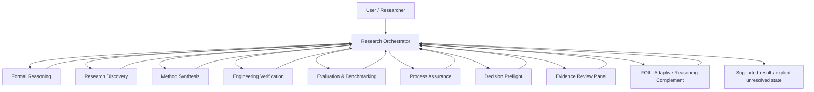

# Architecture

## Overview

The Evidence-Governed Research Toolkit separates **control**, **specialist reasoning**, **assurance**, and **adaptation**.



## Public names and compatibility aliases

| Professional display name | Technical ID / legacy alias | Primary responsibility |
|---|---|---|
| Research Orchestrator | `soul`, `/soul` | frame, decompose, route, integrate, release |
| Formal Reasoning | `mathbot`, `/mind` | proof, logic, probability, formalization |
| Research Discovery | `scoutbot`, `/space` | literature, prior art, existing software, terminology transfer |
| Method Synthesis | `novelbot`, `/reality` | constrained mechanism generation after existing routes fail |
| Engineering Verification | `codebot`, `/power` | implementation, execution, integration, tests |
| Evaluation & Benchmarking | `benchbot`, `/time` | baselines, capability measurement, cost, stop/go |
| Process Assurance Framework | `infinity-gauntlet`, `/gauntlet` | frame/process audit, false-green defense, stale-state checks |
| Decision Preflight Protocol | `meditate` | grounding before consequential dispatch or after failure |
| Evidence Review Panel | `council-of-elders`, `/council` | selective independent evidence/perspective review |
| FOIL — Adaptive Reasoning Complement | `foil`, `/foil` | task/user-specific missing-method support and transfer tracking |

Technical identifiers remain stable for backwards compatibility. Public research materials use the professional display names.

## Evidence flow

1. **Frame** — define the goal, constraints, claim scope, and decision boundary.
2. **Obligations** — identify what must be proved, searched, executed, measured, or left unresolved.
3. **Route** — select the minimum module set needed to satisfy those obligations.
4. **Native verification** — match verifier to claim type: proof, source, execution, benchmark, counterexample, or independent observation.
5. **Assurance** — audit the reasoning/process when release triggers apply.
6. **Synthesis** — integrate by evidence quality and independence rather than votes or confidence.
7. **Release** — return supported conclusions plus an explicit unresolved-work queue.

## Architectural constraints

- user authority governs voluntary goals/actions; evidence governs factual warrant;
- no tool or agent may self-certify merely by labeling its output verified;
- missing integrations fail closed as `UNAVAILABLE`;
- multi-agent agreement is not independent evidence by itself;
- benchmark results do not silently become claims about general capability;
- behavioral efficacy is separate from software/specification correctness;
- public runtime must not depend on private project paths.

## Repository structure

```text
.
├── skills/                  # executable research-method specifications
├── research/                # evidence basis for research mechanisms
├── validation/              # deterministic/specification evidence
├── docs/                    # public technical showcase and architecture
├── .github/                 # CI, security automation, contribution templates
├── RESEARCH.md              # research question, method, baselines, ablations
├── REPRODUCIBILITY.md       # reproduction protocol and evidence boundaries
├── ROADMAP.md               # evidence-first research roadmap
├── CITATION.cff             # machine-readable citation metadata
├── CHANGELOG.md             # version history
└── LICENSE                  # open-source license
```
