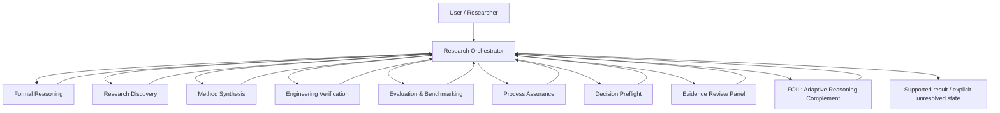

# Architecture

## Overview

The Evidence-Governed Research Toolkit separates **control**, **specialist reasoning**, **assurance**, and **adaptation**.



## Public names and compatibility aliases

| Professional display name | Technical ID / legacy alias | Primary responsibility |
|---|---|---|
| Research Orchestrator | `soul`, `/soul` | frame, decompose, route, integrate, release |
| Formal Reasoning | `mathbot`, `/mind` | proof, logic, probability, formalization |
| Research Discovery | `scoutbot`, `/space` | literature, prior art, existing software, terminology transfer |
| Method Synthesis | `novelbot`, `/reality` | constrained mechanism generation after existing routes fail |
| Engineering Verification | `codebot`, `/power` | implementation, execution, integration, tests |
| Evaluation & Benchmarking | `benchbot`, `/time` | baselines, capability measurement, cost, stop/go |
| Process Assurance Framework | `infinity-gauntlet`, `/gauntlet` | frame/process audit, false-green defense, stale-state checks |
| Decision Preflight Protocol | `meditate` | grounding before consequential dispatch or after failure |
| Evidence Review Panel | `council-of-elders`, `/council` | selective independent evidence/perspective review |
| FOIL — Adaptive Reasoning Complement | `foil`, `/foil` | task/user-specific missing-method support and transfer tracking |

Technical identifiers remain stable for backwards compatibility. Public research materials use the professional display names.

## Runtime module map

Modules are grouped by what they are *authoritative for*. Where two files could
define the same vocabulary, exactly one is the source of truth and the other is
generated from it or tested against it.

### Process Assurance runtime

| Module | Authoritative for |
|---|---|
| `tools/gauntlet_boundary.py` | Stop-hook `frame` / `costume` boundary checks |
| `tools/gauntlet_monitor.py` | stale governing-state detection |
| `tools/gauntlet_hook.py` | Pre/Post tool integration |
| `tools/gauntlet_config.py` | `.gauntlet.json` policy loading |
| `tools/verify_ledger.py` | optional evidence-ledger commit gate |

### FOIL — vocabularies and estimators

| Module | Authoritative for |
|---|---|
| `tools/foil_evidence.py` | **the competence estimator.** Beta posterior with Jeffreys prior, `EvidenceTier` weights, recency decay, `Classification`, and the exact rate calculators. Every threshold that governs a competence claim lives here and nowhere else. |
| `tools/foil_assistance.py` | **the assistance ladder and the `ExecutionOwner` axis.** Emits `ladder_contract_block()`, which `skills/foil/SKILL.md` must contain verbatim. |
| `tools/foil_interventions.py` | **the gap vocabulary (`GAP_KINDS`) and the complement ledger.** Emits `gap_kinds_contract_block()`, likewise pasted verbatim into the skill. |
| `tools/foil_capabilities.py` | capability semantics and claim→capability routing |
| `tools/foil_tool_policy.py` | write-capability admission; raises `CapabilityWriteError` rather than failing silently |
| `tools/foil_domains.py` | non-diagnostic domain-relevance recognition |

Drift between a contract block and its runtime enum is a **test failure**, not a
documentation task: `tests/test_foil_assistance.py::ContractDriftTests` and
`tests/test_foil_ledger_b_items.py::GapVocabularyDriftTests` are live gates.

### FOIL — profile, calibration, and policy

| Module | Authoritative for |
|---|---|
| `tools/foil_profile.py` | persistent profile storage, migration receipts, sanitized `compact_context()` |
| `tools/foil_hook.py` | prompt-time relevance injection within the host payload cap |
| `tools/foil_assessment.py` | Layer 1 broad cold start |
| `tools/foil_layer2.py` | Layer 2A structured cross-cutting screen |
| `tools/foil_calibration.py` | Layer 2B adaptive real-work calibration |
| `tools/foil_policy.py` | **the experimental routing kernel.** Deterministic V2 policy, ported from `origin/experiment/foil-vnext5-vnext@9540860`. Its mechanisms are implemented hypotheses whose efficacy is `NOT_MEASURED`. |

`foil_policy` is the experimental kernel and is labelled as such everywhere it is
referenced. It converts current-task signals plus independently supported profile
evidence into a small deterministic policy. Two properties matter architecturally:

- **The routing regime is derived from task properties** — freshness sensitivity, closed context, multi-hop structure, abstract transformation, closed-book technical reasoning, external-retrieval need. **Benchmark identity is receipt metadata and never a policy selector**, so the same task properties yield the same policy inside and outside an evaluation.
- **A profile can trigger help only** when it describes a verified gap matching a capability the current task actually requires. A wrong, irrelevant, or stale profile is a negative control that cannot route.

### FOIL — model layer

| Module | Authoritative for |
|---|---|
| `tools/foil_models.py` | provider adapters (`openai_chat`, `anthropic_messages`, `ollama_chat`, `cli`, `mock`), determinism classes, `probe()` |
| `tools/foil_setup.py` | `.foil/models.json`, role assignment (`primary`/`reviewer`/`verifier`/`benchmark`) |

The language model is a configured capability, not a build-time assumption. FOIL
requests a role; the host decides which model fills it. An unfilled role reports
`NOT-MEASURED` rather than silently substituting the primary for the reviewer,
because a model critiquing its own output is not independent evidence. Secrets are
referenced by environment-variable *name* and are never stored.

### FOIL — frozen-evaluation boundary

| Module | Authoritative for |
|---|---|
| `tools/foil_task_guard.py` | run binding, hash-chained budget ledger, `guarded_operation()`, `attest()` |
| `tools/foil_tool_broker.py` | **the PreToolUse enforcement boundary** |

## Broker boundary

```text
                        FOIL_TASK_RUN unset
                        ─────────────────────────────────────────────
   model / agent  ──▶  host tool call  ──▶  tool executes
                        (broker no-ops and exits 0; ordinary sessions
                         are unaffected. Any budget here is ADVISORY:
                         foil_task_guard can record a spend, but it
                         cannot observe a call that never invokes it.)


                        FOIL_TASK_RUN set  ── the only enforced path
                        ─────────────────────────────────────────────
   model / agent
        │
        ▼
   host PreToolUse hook
        │
        ▼
   tools/foil_tool_broker.py
        │  1. read binding: task_id + prompt hash + condition + budget
        │  2. binding missing or mismatched ──▶ DENY (misconfiguration,
        │                                       not absence)
        │  3. classify_tool(name)
        │       ├─ unbudgeted tool  ──▶ ALLOW (never guarded by anything;
        │       │                        denying it would break unrelated
        │       │                        work without protecting a unit)
        │       └─ budgeted tool
        │              ├─ budget exhausted ──▶ DENY
        │              └─ reserve one unit  ──▶ ALLOW
        │  (charge happens at RESERVATION: a PreToolUse hook cannot see
        │   the result, so a receipt records ATTEMPTS ADMITTED, not
        │   successful retrievals)
        ▼
   tools/foil_task_guard.py  ── appends a SHA-256 hash-chained event
        ▼
   tool executes
```

What is inside the boundary: budgeted tools routed through the host's PreToolUse
hook during a run opened with `FOIL_TASK_RUN`.

What is outside it, stated plainly: any process that bypasses the host; any tool
the host does not route through hooks; every session where `FOIL_TASK_RUN` is
unset. `foil_task_guard` is a **tamper-evident accounting ledger, not a security
boundary** — `attest()` makes after-the-fact edits detectable, but a call that
never invokes the ledger is invisible to it and must be prevented at the tool
layer.

## Evidence flow

1. **Frame** — define the goal, constraints, claim scope, and decision boundary.
2. **Obligations** — identify what must be proved, searched, executed, measured, or left unresolved.
3. **Route** — select the minimum module set needed to satisfy those obligations.
4. **Native verification** — match verifier to claim type: proof, source, execution, benchmark, counterexample, or independent observation.
5. **Assurance** — audit the reasoning/process when release triggers apply.
6. **Synthesis** — integrate by evidence quality and independence rather than votes or confidence.
7. **Release** — return supported conclusions plus an explicit unresolved-work queue.

## Architectural constraints

- user authority governs voluntary goals/actions; evidence governs factual warrant;
- no tool or agent may self-certify merely by labeling its output verified;
- missing integrations fail closed as `UNAVAILABLE`;
- multi-agent agreement is not independent evidence by itself;
- benchmark results do not silently become claims about general capability;
- behavioral efficacy is separate from software/specification correctness;
- public runtime must not depend on private project paths.

## Repository structure

```text
.
├── skills/                  # executable research-method specifications (SKILL.md only)
├── tools/                   # portable runtime: Process Assurance + FOIL modules
├── tests/                   # runtime, privacy, layout, contract-drift regressions
├── benchmarks/              # blinded benchmark protocols, harnesses, receipts
├── research/                # evidence basis for research mechanisms
├── validation/              # deterministic/specification evidence
├── docs/                    # public technical showcase and architecture
├── .github/                 # CI, security automation, contribution templates
├── RESEARCH.md              # research question, method, baselines, ablations
├── REPRODUCIBILITY.md       # reproduction protocol and evidence boundaries
├── ROADMAP.md               # evidence-first research roadmap
├── CITATION.cff             # machine-readable citation metadata
├── CHANGELOG.md             # version history
└── LICENSE                  # open-source license
```
