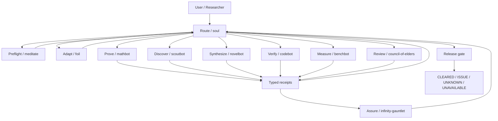

# Instrument 01 Architecture

## Overview

**Rigilum Instrument 01** separates orchestration, specialist reasoning, assurance, preflight, review, and adaptation. The public product vocabulary is intentionally separate from the stable technical/runtime vocabulary so a brand change does not become a breaking software migration.

The vNext typed runtime lets each module produce machine-readable state and receipts without collapsing distinct epistemic obligations into one generic agent interface.



## Product layer vs. technical layer

| Instrument 01 public name | Stable technical ID / command | Primary responsibility | Runtime |
|---|---|---|---|
| **Route** | `soul`, `/soul` | frame, obligations, route, integrate, release | `tools/soul_runtime.py` |
| **Prove** | `mathbot`, `/mind` | proof, logic, exact derivation, formalization | `tools/mind_runtime.py` |
| **Discover** | `scoutbot`, `/space` | literature, prior art, current evidence | `tools/space_runtime.py` + `tools/scout.py` |
| **Synthesize** | `novelbot`, `/reality` | constrained, falsifiable mechanism generation | `tools/reality_runtime.py` |
| **Verify** | `codebot`, `/power` | executable software verification | `tools/power_runtime.py` |
| **Measure** | `benchbot`, `/time` | baselines, paired inference, cost, stop/go | `tools/time_runtime.py` |
| **Assure** | `infinity-gauntlet`, `/gauntlet` | process hazards and false-green defense | `tools/gauntlet_runtime.py` + compatibility hooks |
| **Preflight** | `meditate` | resource-rational decision preflight | `tools/meditate_runtime.py` |
| **Review** | `council-of-elders`, `/council` | commit-reveal evidence review | `tools/council_runtime.py` |
| **Adapt** | `foil`, `/foil` | adaptive complement selection, support, and transfer tracking | existing `foil` runtime + `tools/foil_runtime_bridge.py` |

### Compatibility law

The public names above are the product interface. The following do **not** change in this pre-product branding branch:

- skill-directory names and front-matter technical IDs where required by the runtime;
- slash commands;
- `tools/*_runtime.py` filenames and imports;
- typed schema identifiers;
- state-directory names;
- environment variables;
- benchmark condition names;
- historical validation/research artifact names.

The retired display labels — Research Orchestrator, Formal Reasoning, Research Discovery, Method Synthesis, Engineering Verification, Evaluation & Benchmarking, Process Assurance Framework, Decision Preflight Protocol, Evidence Review Panel, and Mirror — remain migration vocabulary only.

For Adapt specifically, `foil`, `/foil`, `tools/foil_*`, `FOIL_TASK_RUN`, historical FOIL benchmark conditions, and FOIL-named research artifacts remain stable protocol/runtime identifiers. See [`MIRROR.md`](MIRROR.md), whose filename is likewise retained for link compatibility.

## Common typed runtime

Every component exposes five layers:

1. **SPEC** — the obligation and authority boundary.
2. **STATE** — typed machine-readable state/events.
3. **ACTION/TOOL** — actual evidence-producing method.
4. **RECEIPT** — content-addressed result with verifier/provenance/scope.
5. **VERDICT** — scoped `CLEARED | ISSUE | UNKNOWN | UNAVAILABLE`.

Shared runtime files:

- `tools/egrt_types.py`
- `tools/egrt_store.py`
- `tools/egrt_hook.py`
- `tools/egrt_runtime.py`
- `tools/soul_runtime.py`

The full integration flow is frozen in [`VNEXT_RUNTIME_PIPELINE.md`](VNEXT_RUNTIME_PIPELINE.md). Component engineering contracts live under `docs/specs/`.

## Runtime module map

Modules are grouped by what they are authoritative for. Where two files could define the same vocabulary, exactly one is the source of truth and the other is generated from it or tested against it.

### Assure — `infinity-gauntlet` technical namespace

| Module | Authoritative for |
|---|---|
| `tools/gauntlet_boundary.py` | Stop-hook `frame` / `costume` boundary checks |
| `tools/gauntlet_monitor.py` | stale governing-state detection |
| `tools/gauntlet_hook.py` | Pre/Post tool integration |
| `tools/gauntlet_config.py` | `.gauntlet.json` policy loading |
| `tools/verify_ledger.py` | optional evidence-ledger commit gate |

### Internal adversarial review support — Black Gem

Black Gem is an internal implementation component, not an eleventh Instrument 01 product module.

| Module | Authoritative for |
|---|---|
| `tools/blackgem_runtime.py` | the `ADVERSARY` obligation: independent multi-seat attack, off-diagonal cross-critique, synthesis over a frozen candidate, planted-costume canary probe, and whole-run participation accounting |

Black Gem can raise `ISSUE`, `UNKNOWN`, or `UNAVAILABLE`, but never emits `CLEARED`. Surviving an attack panel is absence of a found break, not evidence that a candidate is correct. Raw model text lives only in a declared evidence artifact referenced by `ArtifactRef`, never in generic state or a receipt.

### Adapt — FOIL protocol vocabularies and estimators

| Module | Authoritative for |
|---|---|
| `tools/foil_evidence.py` | competence estimator: Beta posterior, `EvidenceTier` weights, recency decay, `Classification`, and rate calculators |
| `tools/foil_assistance.py` | assistance ladder and the `ExecutionOwner` axis; emits the contract block required by `skills/foil/SKILL.md` |
| `tools/foil_interventions.py` | gap vocabulary (`GAP_KINDS`) and complement ledger; emits the skill contract block |
| `tools/foil_capabilities.py` | capability semantics and claim→capability routing |
| `tools/foil_tool_policy.py` | write-capability admission |
| `tools/foil_domains.py` | non-diagnostic domain-relevance recognition |

Drift between generated contract blocks and runtime enums is a test failure, not a documentation task. The live gates are `tests/test_foil_assistance.py::ContractDriftTests` and `tests/test_foil_ledger_b_items.py::GapVocabularyDriftTests`.

### Adapt — FOIL profile, calibration, and policy

| Module | Authoritative for |
|---|---|
| `tools/foil_profile.py` | persistent profile storage, migration receipts, sanitized `compact_context()` |
| `tools/foil_hook.py` | prompt-time relevance injection within host payload limits |
| `tools/foil_assessment.py` | Layer 1 broad cold start |
| `tools/foil_layer2.py` | Layer 2A structured cross-cutting screen |
| `tools/foil_calibration.py` | Layer 2B adaptive real-work calibration |
| `tools/foil_policy.py` | experimental routing kernel |

The routing regime is derived from task properties rather than benchmark identity. A profile can trigger help only when it describes a verified gap matching a capability the current task actually requires. Wrong, irrelevant, or stale profile information is a negative control that cannot route by itself.

### Adapt — FOIL model layer

| Module | Authoritative for |
|---|---|
| `tools/foil_models.py` | provider adapters, determinism classes, and `probe()` |
| `tools/foil_setup.py` | `.foil/models.json` and role assignment (`primary` / `reviewer` / `verifier` / `benchmark`) |

The language model is a configured capability, not a build-time assumption. Adapt requests a role through the FOIL protocol; the host decides which model fills it. An unfilled role reports `NOT-MEASURED` rather than silently substituting the primary model for an independent reviewer. Secrets are referenced by environment-variable name and never stored.

### Adapt — frozen-evaluation boundary

| Module | Authoritative for |
|---|---|
| `tools/foil_task_guard.py` | run binding, hash-chained budget ledger, `guarded_operation()`, `attest()` |
| `tools/foil_tool_broker.py` | PreToolUse enforcement boundary |

`FOIL_TASK_RUN` remains the protocol-level environment variable. When unset, an ordinary session is unaffected and any budget is advisory. When set, the broker validates the frozen run binding before a budgeted tool call is admitted. The hash-chained ledger is tamper-evident accounting, not a security boundary: calls that bypass the broker are outside its observation surface.

## Evidence flow

1. **Frame** — define goal, success condition, constraints, stakes, and decision boundary.
2. **Obligations** — create typed claims that must be proved, searched, synthesized, executed, measured, assured, preflighted, reviewed, or adapted.
3. **Preflight** — when explicit triggers are present, Preflight decides whether another computation is worth performing.
4. **Adapt** — Adapt may alter routing priority or representation, never factual authority.
5. **Route** — Route selects the minimum claim-native module set.
6. **Act** — Prove / Discover / Synthesize / Verify / Measure / Review run their methods.
7. **Receipt** — record hashes, verifier/tool identity, provenance, scope, uncertainty, and unresolved state.
8. **Assure** — Assure checks typed process hazards and declares monitorability limits.
9. **Release gate** — the stable `soul` runtime checks all load-bearing obligations.
10. **Release** — return a supported result or explicit `ISSUE`, `UNKNOWN`, or `UNAVAILABLE` state.

## Architectural constraints

- user authority governs voluntary goals/actions; evidence governs factual warrant;
- no tool, module, agent, company label, or product label may self-certify by name;
- missing integrations become `UNAVAILABLE`, not fabricated pass/fail;
- incomplete state becomes `UNKNOWN`, not silent negative evidence;
- solver results apply to the encoding checked, not automatically to an English generalization;
- multi-agent agreement is not independent evidence;
- search saturation does not prove nonexistence;
- green software checks certify only named checks/defect classes;
- benchmark results do not silently become claims about general capability;
- behavioral efficacy is separate from software/specification correctness;
- generic runtime persists prompt/tool hashes, not raw prompt/tool content;
- public runtime must not depend on private workstation paths;
- Mastermind is not part of this repository runtime.

## Runtime state

Default state root: `.egrt/state/`.

```text
.egrt/state/
├── runtime/
│   ├── tasks/
│   ├── receipts/
│   ├── events/
│   ├── councils/
│   ├── meditate/
│   ├── space/
│   ├── reality/
│   ├── power/
│   └── time/
├── gauntlet_boundary.json
└── gauntlet_monitor.json
```

State remains gitignored and owner-restricted where POSIX permissions are available.

## Repository structure

```text
.
├── skills/                  # installable research-method specifications; public names map to stable technical IDs
├── tools/                   # portable typed runtime + Assure/gauntlet + Adapt/FOIL protocol modules
├── tests/                   # runtime, privacy, layout, contract-drift regressions
├── benchmarks/              # blinded protocols, harnesses, and receipts
├── research/                # evidence basis for research mechanisms
├── validation/              # deterministic/specification evidence + brand decision record
├── docs/specs/              # per-component engineering contracts
├── docs/MIRROR.md           # Adapt public-name / FOIL compatibility contract; filename retained
├── docs/VNEXT_RUNTIME_PIPELINE.md
├── .claude/settings.json    # hook wiring
├── .gauntlet.json           # runtime/assurance configuration
├── RESEARCH.md
├── REPRODUCIBILITY.md
├── ROADMAP.md
├── CITATION.cff
├── CHANGELOG.md
└── LICENSE
```

## Branding boundary

This architecture describes the working pre-product identity **Rigilum / Instrument 01**. It does not assert corporate-name or trademark clearance. Repository transfer, package namespace changes, URL changes, or runtime-ID migrations require separate change control.