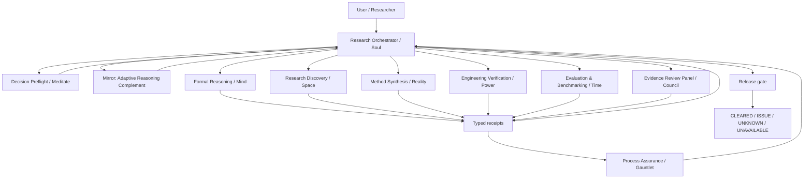

# Architecture

## Overview

The Evidence-Governed Research Toolkit separates **control**, **specialist reasoning**, **assurance**, **preflight**, **review**, and **adaptation**. vNext adds a common typed runtime so each module can produce machine-readable state and receipts without collapsing distinct epistemic obligations into one generic agent interface.



## Common typed runtime

Every component exposes five layers:

1. **SPEC** — the obligation and authority boundary.
2. **STATE** — typed machine-readable state/events.
3. **ACTION/TOOL** — actual evidence-producing method.
4. **RECEIPT** — content-addressed result with verifier/provenance/scope.
5. **VERDICT** — scoped `CLEARED | ISSUE | UNKNOWN | UNAVAILABLE`.

Shared runtime files:

- `tools/egrt_types.py`
- `tools/egrt_store.py`
- `tools/egrt_hook.py`
- `tools/egrt_runtime.py`
- `tools/soul_runtime.py`

The full integration flow is frozen in [`VNEXT_RUNTIME_PIPELINE.md`](VNEXT_RUNTIME_PIPELINE.md). Component engineering contracts live under `docs/specs/`.

## Public names and compatibility aliases

| Professional display name | Technical ID / legacy alias | Primary responsibility | Runtime |
|---|---|---|---|
| Research Orchestrator | `soul`, `/soul` | frame, obligations, route, integrate, release | `tools/soul_runtime.py` |
| Formal Reasoning | `mathbot`, `/mind` | proof, logic, exact derivation, formalization | `tools/mind_runtime.py` |
| Research Discovery | `scoutbot`, `/space` | literature, prior art, current evidence | `tools/space_runtime.py` + `tools/scout.py` |
| Method Synthesis | `novelbot`, `/reality` | constrained, falsifiable mechanism generation | `tools/reality_runtime.py` |
| Engineering Verification | `codebot`, `/power` | executable software verification | `tools/power_runtime.py` |
| Evaluation & Benchmarking | `benchbot`, `/time` | baselines, paired inference, cost, stop/go | `tools/time_runtime.py` |
| Process Assurance Framework | `infinity-gauntlet`, `/gauntlet` | process hazards and false-green defense | `tools/gauntlet_runtime.py` + compatibility hooks |
| Decision Preflight Protocol | `meditate` | resource-rational preflight/control | `tools/meditate_runtime.py` |
| Evidence Review Panel | `council-of-elders`, `/council` | commit-reveal evidence review | `tools/council_runtime.py` |
| Mirror — Adaptive Reasoning Complement | `foil`, `/foil` | adaptive complement selection, support, and transfer tracking | existing `foil` runtime + `tools/foil_runtime_bridge.py` |

**Mirror** is the public display name. `foil`, `/foil`, `tools/foil_*`, `FOIL_TASK_RUN`, historical benchmark conditions, and FOIL-named artifact files remain stable compatibility identifiers. See [`MIRROR.md`](MIRROR.md).

Technical identifiers remain stable for backwards compatibility. Names are user-facing mnemonics; evidence authority comes from receipts, not naming.

## Runtime module map

Modules are grouped by what they are *authoritative for*. Where two files could
define the same vocabulary, exactly one is the source of truth and the other is
generated from it or tested against it.

### Process Assurance runtime

| Module | Authoritative for |
|---|---|
| `tools/gauntlet_boundary.py` | Stop-hook `frame` / `costume` boundary checks |
| `tools/gauntlet_monitor.py` | stale governing-state detection |
| `tools/gauntlet_hook.py` | Pre/Post tool integration |
| `tools/gauntlet_config.py` | `.gauntlet.json` policy loading |
| `tools/verify_ledger.py` | optional evidence-ledger commit gate |

### Adversarial review — Black Gem

| Module | Authoritative for |
|---|---|
| `tools/blackgem_runtime.py` | **the `ADVERSARY` obligation.** Independent multi-seat attack, off-diagonal cross-critique, and synthesis over a frozen candidate, with a planted-costume canary probe and whole-run participation accounting. |

Black Gem produces the `ADVERSARY` obligation in the release gate's producer row.
It can raise an `ISSUE` (a surviving break, a `KILL`, or an `AMEND`), and it can
report `UNKNOWN` or `UNAVAILABLE` — but it **never emits `CLEARED`**, enforced by an
assertion in `finalize`. Surviving an attack panel is the absence of a found break,
not evidence that a candidate is correct, so clearing an obligation is not a state
this module can reach. `probe_trusted` (a canary caught this run) is kept separate
from `trusted` (probe trust *and* complete participation *and* at least two distinct
provenance groups), and raw model text lives only in a declared evidence artifact
referenced by `ArtifactRef`, never in generic state or the receipt.

### Mirror (`foil`) — vocabularies and estimators

| Module | Authoritative for |
|---|---|
| `tools/foil_evidence.py` | **the competence estimator.** Beta posterior with Jeffreys prior, `EvidenceTier` weights, recency decay, `Classification`, and the exact rate calculators. Every threshold that governs a competence claim lives here and nowhere else. |
| `tools/foil_assistance.py` | **the assistance ladder and the `ExecutionOwner` axis.** Emits `ladder_contract_block()`, which `skills/foil/SKILL.md` must contain verbatim. |
| `tools/foil_interventions.py` | **the gap vocabulary (`GAP_KINDS`) and the complement ledger.** Emits `gap_kinds_contract_block()`, likewise pasted verbatim into the skill. |
| `tools/foil_capabilities.py` | capability semantics and claim→capability routing |
| `tools/foil_tool_policy.py` | write-capability admission; raises `CapabilityWriteError` rather than failing silently |
| `tools/foil_domains.py` | non-diagnostic domain-relevance recognition |

Drift between a contract block and its runtime enum is a **test failure**, not a
documentation task: `tests/test_foil_assistance.py::ContractDriftTests` and
`tests/test_foil_ledger_b_items.py::GapVocabularyDriftTests` are live gates.

### Mirror (`foil`) — profile, calibration, and policy

| Module | Authoritative for |
|---|---|
| `tools/foil_profile.py` | persistent profile storage, migration receipts, sanitized `compact_context()` |
| `tools/foil_assistance_policy.py` | **the deterministic assistance selector.** Starts teaching at A1, consumes only typed evidence and explicit task state, raises a persistent floor only after observed failure, preserves the floor across A0 ownership probes, and fades to A0 only after earned strength. It never reads an answer or writes a profile. |
| `tools/foil_contract_audit.py` | **the executable 19-section SKILL contract audit.** Requires every `must`/`never` line to be mapped to existing tests, partial evidence, or `UNTESTABLE_AS_WRITTEN`; new unmapped modal lines fail closed. |
| `tools/foil_hook.py` | prompt-time relevance injection within the host payload cap |
| `tools/foil_assessment.py` | Layer 1 broad cold start |
| `tools/foil_layer2.py` | Layer 2A structured cross-cutting screen |
| `tools/foil_calibration.py` | Layer 2B adaptive real-work calibration |
| `tools/foil_policy.py` | **the experimental routing kernel.** Deterministic V2 policy, ported from `origin/experiment/foil-vnext5-vnext@9540860`. Its mechanisms are implemented hypotheses whose efficacy is `NOT_MEASURED`. |
| `tools/foil_adaptive_route.py` | **the default-off adaptive-compute shadow controller.** Retains frozen A0 as DIRECT and may recommend VERIFY/FULL only from positive frozen EV and compiler-created host-declared routes. It never executes or changes authority. |
| `tools/foil_adaptive_executor.py` | **the benchmark-only active execution bridge.** Consumes an immutable shadow decision, binds frozen A0, and executes at most one named route when an explicit benchmark policy enables it. It grants no production or promotion authority. |
| `tools/foil_shadow_route_ledger.py` | **the default-off observational RouteVector ledger.** Exact task/model/contract/route history only; no selector, fitter, controller update, or component credit. |
| `tools/foil_v5_pipeline.py` | **the integrated structured shadow seam.** Wires compiler, scanner, adaptive route, optional observational ledger, and the pure host finalizer without candidate generation or execution. |
| `tools/foil_obligation_discovery.py` | **the default-off annotated-arithmetic generator.** Accepts only task text, immutable A0, and their digests; emits a `GENERATED_UNADMITTED` envelope and never grants action authority. |
| `tools/foil_obligation_discovery_v2.py` | **the version-isolated R1.7 provenance repair.** Adds a closed structured derivation grammar while preserving v1 behavior; remains default-off and `GENERATED_UNADMITTED`. |
| `tools/foil_certified_arithmetic.py` | **the production certified-arithmetic parser.** Freezes `certified-v2` and exposes powers and complete raw numeric lines only as separate versioned languages. |
| `tools/foil_arithmetic_rule_bank.py` | **the default-off arithmetic rule bank.** Emits exact numeric-equality obligations plus joint trace-constraint consistency; it never localizes blame or authorizes repair. |
| `tools/foil_obligation_discovery_admission.py` | **the sole production bridge for discovered specs.** Supports the closed v1/v2/rule-bank envelope set and requires an admitted receipt plus the exact route/config binding; no generated route currently has qualifying evidence. |
| `tools/foil_formalization_admission.py`; `tools/foil_formalization_routing.py` | **the external generated-spec admission boundary.** Requires route-scoped fidelity/extraction evidence and preserves generated origin; no generated route is currently calibrated or admitted. |
| `tools/foil_promotion_gates.py` | **the candidate-bound external gate evaluator.** Converts complete preregistered evidence matrices into fail-closed Gate 1/2/3 receipts; it collects no data. |
| `tools/foil_later_studies.py` | **the later-study topology validator.** Freezes P0, RQ-26, model-ladder, history, and human-complement arms without claiming efficacy. |

`foil_policy` is the experimental kernel and is labelled as such everywhere it is
referenced. It converts current-task signals plus independently supported profile
evidence into a small deterministic policy. Two properties matter architecturally:

- **The routing regime is derived from task properties** — freshness sensitivity, closed context, multi-hop structure, abstract transformation, closed-book technical reasoning, external-retrieval need. **Benchmark identity is receipt metadata and never a policy selector**, so the same task properties yield the same policy inside and outside an evaluation.
- **A profile can trigger help only** when it describes a verified gap matching a capability the current task actually requires. A wrong, irrelevant, or stale profile is a negative control that cannot route.

The PERSON surface has two deterministic, zero-provider conformance harnesses:
`benchmarks/harness/foil_assistance_replay.py` replays frozen ownership and ladder
scenarios, while `benchmarks/harness/foil_persona_simulation.py` runs scripted
personas with known skill and minimum-assistance vectors. These prove named state
transitions and estimator invariants only; they are not evidence of human-learning
efficacy, production personalization quality, or calibration on real people.

### Mirror (`foil`) — model layer

| Module | Authoritative for |
|---|---|
| `tools/foil_models.py` | provider adapters (`openai_chat`, `anthropic_messages`, `ollama_chat`, `cli`, `mock`), determinism classes, `probe()` |
| `tools/foil_setup.py` | `.foil/models.json`, role assignment (`primary`/`reviewer`/`verifier`/`benchmark`) |

The language model is a configured capability, not a build-time assumption. Mirror
requests a role; the host decides which model fills it. An unfilled role reports
`NOT-MEASURED` rather than silently substituting the primary for the reviewer,
because a model critiquing its own output is not independent evidence. Secrets are
referenced by environment-variable *name* and are never stored.

### Mirror (`foil`) — frozen-evaluation boundary

| Module | Authoritative for |
|---|---|
| `tools/foil_task_guard.py` | run binding, hash-chained budget ledger, `guarded_operation()`, `attest()` |
| `tools/foil_tool_broker.py` | **the PreToolUse enforcement boundary** |

## Broker boundary

```text
                        FOIL_TASK_RUN unset
                        ─────────────────────────────────────────────
   model / agent  ──▶  host tool call  ──▶  tool executes
                        (broker no-ops and exits 0; ordinary sessions
                         are unaffected. Any budget here is ADVISORY:
                         foil_task_guard can record a spend, but it
                         cannot observe a call that never invokes it.)


                        FOIL_TASK_RUN set  ── the only enforced path
                        ─────────────────────────────────────────────
   model / agent
        │
        ▼
   host PreToolUse hook
        │
        ▼
   tools/foil_tool_broker.py
        │  1. read binding: task_id + prompt hash + condition + budget
        │  2. binding missing or mismatched ──▶ DENY (misconfiguration,
        │                                       not absence)
        │  3. classify_tool(name)
        │       ├─ unbudgeted tool  ──▶ ALLOW (never guarded by anything;
        │       │                        denying it would break unrelated
        │       │                        work without protecting a unit)
        │       └─ budgeted tool
        │              ├─ budget exhausted ──▶ DENY
        │              └─ reserve one unit  ──▶ ALLOW
        │  (charge happens at RESERVATION: a PreToolUse hook cannot see
        │   the result, so a receipt records ATTEMPTS ADMITTED, not
        │   successful retrievals)
        ▼
   tools/foil_task_guard.py  ── appends a SHA-256 hash-chained event
        ▼
   tool executes
```

What is inside the boundary: budgeted tools routed through the host's PreToolUse
hook during a run opened with `FOIL_TASK_RUN`.

What is outside it, stated plainly: any process that bypasses the host; any tool
the host does not route through hooks; every session where `FOIL_TASK_RUN` is
unset. `foil_task_guard` is a **tamper-evident accounting ledger, not a security
boundary** — `attest()` makes after-the-fact edits detectable, but a call that
never invokes the ledger is invisible to it and must be prevented at the tool
layer.

## Evidence flow

1. **Frame** — define goal, success condition, constraints, stakes and decision boundary.
2. **Obligations** — create typed claims that must be proved, searched, synthesized, executed, measured, assured, preflighted, reviewed or adapted.
3. **Preflight** — when explicit triggers are present, Meditate decides whether another computation is worth performing.
4. **Adapt** — Mirror may alter routing priority or representation, never factual authority.
5. **Route** — select the minimum claim-native module set.
6. **Act** — run proof/search/synthesis/test/evaluation/review methods.
7. **Receipt** — record hashes, verifier/tool identity, provenance, scope, uncertainty and unresolved state.
8. **Assure** — Gauntlet checks typed process hazards and declares monitorability limits.
9. **Release gate** — Soul checks all load-bearing obligations.
10. **Release** — return a supported result or explicit `ISSUE`, `UNKNOWN`, or `UNAVAILABLE` state.

## Architectural constraints

- user authority governs voluntary goals/actions; evidence governs factual warrant;
- no tool, module or agent may self-certify by label;
- missing integrations become `UNAVAILABLE`, not fabricated pass/fail;
- incomplete state becomes `UNKNOWN`, not silent negative evidence;
- solver results apply to the encoding checked, not automatically to an English generalization;
- multi-agent agreement is not independent evidence;
- search saturation does not prove nonexistence;
- green software checks certify only named checks/defect classes;
- benchmark results do not silently become claims about general capability;
- behavioral efficacy is separate from software/specification correctness;
- generic runtime persists prompt/tool hashes, not raw prompt/tool content;
- public runtime must not depend on private workstation paths;
- Mastermind is not part of this repository runtime.

## Runtime state

Default state root: `.egrt/state/`.

```text
.egrt/state/
├── runtime/
│   ├── tasks/
│   ├── receipts/
│   ├── events/
│   ├── councils/
│   ├── meditate/
│   ├── space/
│   ├── reality/
│   ├── power/
│   └── time/
├── gauntlet_boundary.json
└── gauntlet_monitor.json
```

State remains gitignored and owner-restricted where POSIX permissions are available.

## Repository structure

```text
.
├── skills/                  # executable research-method specifications (SKILL.md only)
├── tools/                   # portable runtime: typed runtime + Process Assurance + Mirror/legacy foil modules
├── tests/                   # runtime, privacy, layout, contract-drift regressions
├── benchmarks/              # blinded benchmark protocols, harnesses, receipts
├── research/                # evidence basis for research mechanisms
├── validation/              # deterministic/specification evidence
├── docs/specs/              # per-component engineering contracts
├── docs/MIRROR.md           # public name and compatibility contract for the foil subsystem
├── docs/VNEXT_RUNTIME_PIPELINE.md
├── .claude/settings.json    # hook wiring
├── .gauntlet.json           # runtime/assurance configuration
├── RESEARCH.md
├── REPRODUCIBILITY.md
├── ROADMAP.md
├── CITATION.cff
├── CHANGELOG.md
└── LICENSE
```
